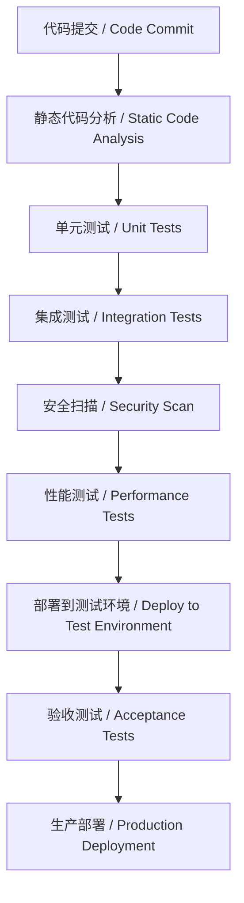
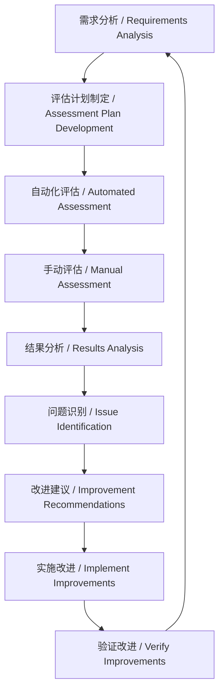

# 评估框架与测试标准 / Evaluation Framework and Testing Standards

> 本文档建立全面的评估和测试标准体系，包括代码质量、性能指标、用户体验等评估规则
> This document establishes a comprehensive evaluation and testing standards system, including code quality, performance metrics, user experience and other evaluation rules

**最后更新 / Last updated: 2025年09月02日 11:30:34**

---

## 📋 目录 / Table of Contents

- [概述 / Overview](#概述--overview)
- [代码质量评估标准 / Code Quality Assessment Standards](#代码质量评估标准--code-quality-assessment-standards)
- [性能评估指标体系 / Performance Assessment Metrics System](#性能评估指标体系--performance-assessment-metrics-system)
- [用户体验评估标准 / User Experience Assessment Standards](#用户体验评估标准--user-experience-assessment-standards)
- [测试策略与标准 / Testing Strategy and Standards](#测试策略与标准--testing-strategy-and-standards)
- [安全评估框架 / Security Assessment Framework](#安全评估框架--security-assessment-framework)
- [评估流程与工具 / Assessment Process and Tools](#评估流程与工具--assessment-process-and-tools)
- [评估报告模板 / Assessment Report Templates](#评估报告模板--assessment-report-templates)
- [持续改进机制 / Continuous Improvement Mechanism](#持续改进机制--continuous-improvement-mechanism)

---

## 概述 / Overview

### 评估框架目标 / Assessment Framework Objectives

评估框架旨在建立系统化的质量保障体系，确保AI编程项目的各个方面都达到预期的质量标准。

The assessment framework aims to establish a systematic quality assurance system to ensure that all aspects of AI programming projects meet expected quality standards.

### 评估维度 / Assessment Dimensions

```xml
<assessment_dimensions>
  <quality_dimensions>
    <!-- 质量维度 / Quality dimensions -->
    <code_quality>代码质量 / Code quality</code_quality>
    <architecture_quality>架构质量 / Architecture quality</architecture_quality>
    <documentation_quality>文档质量 / Documentation quality</documentation_quality>
  </quality_dimensions>

  <performance_dimensions>
    <!-- 性能维度 / Performance dimensions -->
    <runtime_performance>运行时性能 / Runtime performance</runtime_performance>
    <scalability_performance>可扩展性性能 / Scalability performance</scalability_performance>
    <resource_efficiency>资源利用效率 / Resource efficiency</resource_efficiency>
  </performance_dimensions>

  <experience_dimensions>
    <!-- 体验维度 / Experience dimensions -->
    <user_experience>用户体验 / User experience</user_experience>
    <developer_experience>开发者体验 / Developer experience</developer_experience>
    <maintainability>可维护性 / Maintainability</maintainability>
  </experience_dimensions>

  <security_dimensions>
    <!-- 安全维度 / Security dimensions -->
    <data_security>数据安全 / Data security</data_security>
    <system_security>系统安全 / System security</system_security>
    <compliance_security>合规安全 / Compliance security</compliance_security>
  </security_dimensions>
</assessment_dimensions>
```

### 评估原则 / Assessment Principles

1. **客观性原则** / Objectivity Principle: 使用量化指标和自动化工具
2. **全面性原则** / Comprehensiveness Principle: 覆盖所有关键质量维度
3. **一致性原则** / Consistency Principle: 统一的评估标准和流程
4. **持续性原则** / Continuity Principle: 建立持续的评估和改进机制

---

## 代码质量评估标准 / Code Quality Assessment Standards

### 🎯 1. 代码质量指标体系 / Code Quality Metrics System

#### 静态代码分析指标 / Static Code Analysis Metrics

```xml
<static_analysis_metrics>
  <complexity_metrics>
    <!-- 复杂度指标 / Complexity metrics -->
    <cyclomatic_complexity>圈复杂度 / Cyclomatic complexity</cyclomatic_complexity>
    <cognitive_complexity>认知复杂度 / Cognitive complexity</cognitive_complexity>
    <maintainability_index>可维护性指数 / Maintainability index</maintainability_index>
  </complexity_metrics>

  <code_style_metrics>
    <!-- 代码风格指标 / Code style metrics -->
    <line_length>行长度 / Line length</line_length>
    <indentation_consistency>缩进一致性 / Indentation consistency</indentation_consistency>
    <naming_conventions>命名规范 / Naming conventions</naming_conventions>
  </code_style_metrics>

  <code_smell_metrics>
    <!-- 代码异味指标 / Code smell metrics -->
    <duplicate_code>重复代码 / Duplicate code</duplicate_code>
    <long_methods>过长方法 / Long methods</long_methods>
    <large_classes>过大类 / Large classes</large_classes>
  </code_smell_metrics>
</static_analysis_metrics>
```

#### 质量评分标准 / Quality Scoring Standards

| 指标类别 / Metric Category | 优秀 / Excellent | 良好 / Good | 合格 / Qualified | 不合格 / Unqualified |
|---------------------------|------------------|-------------|------------------|---------------------|
| 圈复杂度 / Cyclomatic Complexity | ≤ 10 | ≤ 15 | ≤ 20 | > 20 |
| 重复代码率 / Duplicate Code Rate | < 3% | < 5% | < 8% | ≥ 8% |
| 单元测试覆盖率 / Unit Test Coverage | ≥ 90% | ≥ 80% | ≥ 70% | < 70% |
| 代码行数/方法 / Lines per Method | ≤ 30 | ≤ 50 | ≤ 100 | > 100 |

### 🔍 2. 代码审查标准 / Code Review Standards

#### 审查清单 / Review Checklist

**功能正确性 / Functional Correctness:**
- [ ] 代码实现了预期的功能需求
- [ ] 边界条件得到正确处理
- [ ] 错误处理机制完善
- [ ] 输入验证充分

**代码质量 / Code Quality:**
- [ ] 遵循项目的编码规范
- [ ] 代码结构清晰，逻辑合理
- [ ] 变量和方法命名准确
- [ ] 注释完整且有用

**性能考虑 / Performance Considerations:**
- [ ] 没有明显的性能问题
- [ ] 资源使用合理
- [ ] 避免了不必要的计算
- [ ] 考虑了内存和CPU使用效率

**安全性 / Security:**
- [ ] 没有安全漏洞
- [ ] 数据处理安全
- [ ] 权限控制适当
- [ ] 日志记录完整

### 📊 3. 技术债务评估 / Technical Debt Assessment

#### 技术债务量化模型 / Technical Debt Quantification Model

```xml
<technical_debt_model>
  <debt_factors>
    <!-- 债务因素 / Debt factors -->
    <code_quality_debt>代码质量债务 / Code quality debt</code_quality_debt>
    <architecture_debt>架构债务 / Architecture debt</architecture_debt>
    <test_debt>测试债务 / Test debt</test_debt>
    <documentation_debt>文档债务 / Documentation debt</documentation_debt>
  </debt_factors>

  <debt_calculation>
    <!-- 债务计算 / Debt calculation -->
    <severity_weight>严重程度权重 / Severity weight</severity_weight>
    <effort_estimate>修复工作量估算 / Effort estimate</effort_estimate>
    <business_impact>业务影响评估 / Business impact assessment</business_impact>
  </debt_calculation>
</technical_debt_model>
```

#### 技术债务评分表 / Technical Debt Scoring Table

| 债务类型 / Debt Type | 轻微 / Minor | 中等 / Moderate | 严重 / Major | 紧急 / Critical |
|---------------------|----------------|----------------|-------------|----------------|
| 代码质量债务 | 1-5 点 | 6-15 点 | 16-30 点 | 31+ 点 |
| 架构债务 | 5-15 点 | 16-40 点 | 41-80 点 | 81+ 点 |
| 测试债务 | 2-8 点 | 9-25 点 | 26-50 点 | 51+ 点 |
| 文档债务 | 1-3 点 | 4-10 点 | 11-25 点 | 26+ 点 |

---

## 性能评估指标体系 / Performance Assessment Metrics System

### ⚡ 4. 运行时性能指标 / Runtime Performance Metrics

#### 响应时间指标 / Response Time Metrics

```xml
<response_time_metrics>
  <latency_metrics>
    <!-- 延迟指标 / Latency metrics -->
    <average_response_time>平均响应时间 / Average response time</average_response_time>
    <percentile_response_time>百分位响应时间 / Percentile response time</percentile_response_time>
    <maximum_response_time>最大响应时间 / Maximum response time</maximum_response_time>
  </latency_metrics>

  <throughput_metrics>
    <!-- 吞吐量指标 / Throughput metrics -->
    <requests_per_second>每秒请求数 / Requests per second</requests_per_second>
    <transactions_per_minute>每分钟事务数 / Transactions per minute</transactions_per_minute>
    <concurrent_users>并发用户数 / Concurrent users</concurrent_users>
  </throughput_metrics>
</xml>
```

#### 性能基准标准 / Performance Benchmark Standards

| 性能指标 / Performance Metric | 优秀 / Excellent | 良好 / Good | 合格 / Qualified | 不合格 / Unqualified |
|-------------------------------|------------------|-------------|------------------|---------------------|
| API响应时间 / API Response Time | < 200ms | < 500ms | < 1000ms | ≥ 1000ms |
| 页面加载时间 / Page Load Time | < 1s | < 2s | < 3s | ≥ 3s |
| 每秒请求数 / Requests per Second | > 1000 | > 500 | > 200 | ≤ 200 |
| 错误率 / Error Rate | < 0.1% | < 0.5% | < 1% | ≥ 1% |

### 📈 5. 可扩展性评估 / Scalability Assessment

#### 扩展能力指标 / Scalability Capability Metrics

```xml
<scalability_metrics>
  <load_handling>
    <!-- 负载处理 / Load handling -->
    <horizontal_scaling>水平扩展能力 / Horizontal scaling capability</horizontal_scaling>
    <vertical_scaling>垂直扩展能力 / Vertical scaling capability</vertical_scaling>
    <auto_scaling>自动扩展能力 / Auto-scaling capability</auto_scaling>
  </load_handling>

  <resource_efficiency>
    <!-- 资源效率 / Resource efficiency -->
    <cpu_utilization>CPU利用率 / CPU utilization</cpu_utilization>
    <memory_utilization>内存利用率 / Memory utilization</memory_utilization>
    <network_utilization>网络利用率 / Network utilization</network_utilization>
  </resource_efficiency>
</xml>
```

#### 扩展性测试场景 / Scalability Test Scenarios

**负载测试场景 / Load Testing Scenarios:**
1. **正常负载测试** / Normal Load Testing: 模拟正常使用情况
2. **峰值负载测试** / Peak Load Testing: 模拟高峰使用情况
3. **压力测试** / Stress Testing: 超出正常负载的测试
4. **容量测试** / Volume Testing: 大数据量处理测试

**并发测试场景 / Concurrency Testing Scenarios:**
1. **多用户并发** / Multi-user Concurrency: 多个用户同时操作
2. **资源竞争** / Resource Competition: 测试资源访问冲突
3. **死锁检测** / Deadlock Detection: 检测潜在的死锁情况

### 💾 6. 资源利用效率评估 / Resource Utilization Efficiency Assessment

#### 资源监控指标 / Resource Monitoring Metrics

```xml
<resource_monitoring>
  <compute_resources>
    <!-- 计算资源 / Compute resources -->
    <cpu_usage>CPU使用率 / CPU usage</cpu_usage>
    <memory_usage>内存使用率 / Memory usage</memory_usage>
    <disk_io>磁盘I/O / Disk I/O</disk_io>
  </compute_resources>

  <network_resources>
    <!-- 网络资源 / Network resources -->
    <bandwidth_usage>带宽使用率 / Bandwidth usage</bandwidth_usage>
    <latency>网络延迟 / Network latency</latency>
    <packet_loss>丢包率 / Packet loss</packet_loss>
  </network_resources>

  <storage_resources>
    <!-- 存储资源 / Storage resources -->
    <storage_capacity>存储容量 / Storage capacity</storage_capacity>
    <data_throughput>数据吞吐量 / Data throughput</data_throughput>
    <backup_recovery>备份恢复 / Backup recovery</backup_recovery>
  </storage_resources>
</resource_monitoring>
```

#### 资源效率基准 / Resource Efficiency Benchmarks

| 资源类型 / Resource Type | 效率指标 / Efficiency Metric | 目标值 / Target Value |
|-------------------------|-----------------------------|----------------------|
| CPU利用率 / CPU Utilization | 平均使用率 / Average Usage | < 70% |
| 内存利用率 / Memory Utilization | 峰值使用率 / Peak Usage | < 80% |
| 磁盘I/O / Disk I/O | 响应时间 / Response Time | < 10ms |
| 网络带宽 / Network Bandwidth | 利用率 / Utilization | < 75% |

---

## 用户体验评估标准 / User Experience Assessment Standards

### 👥 7. 可用性评估 / Usability Assessment

#### 可用性指标体系 / Usability Metrics System

```xml
<usability_metrics>
  <effectiveness_metrics>
    <!-- 有效性指标 / Effectiveness metrics -->
    <task_completion_rate>任务完成率 / Task completion rate</task_completion_rate>
    <error_rate>错误率 / Error rate</error_rate>
    <user_satisfaction>用户满意度 / User satisfaction</user_satisfaction>
  </effectiveness_metrics>

  <efficiency_metrics>
    <!-- 效率指标 / Efficiency metrics -->
    <task_completion_time>任务完成时间 / Task completion time</task_completion_time>
    <learning_time>学习时间 / Learning time</learning_time>
    <navigation_efficiency>导航效率 / Navigation efficiency</navigation_efficiency>
  </efficiency_metrics>

  <satisfaction_metrics>
    <!-- 满意度指标 / Satisfaction metrics -->
    <ease_of_use>易用性 / Ease of use</ease_of_use>
    <visual_appeal>视觉吸引力 / Visual appeal</visual_appeal>
    <content_quality>内容质量 / Content quality</content_quality>
  </satisfaction_metrics>
</usability_metrics>
```

#### 用户体验评分标准 / User Experience Scoring Standards

| 评估维度 / Assessment Dimension | 优秀 / Excellent (9-10) | 良好 / Good (7-8) | 合格 / Qualified (5-6) | 不合格 / Unqualified (<5) |
|-------------------------------|-------------------------|-------------------|-----------------------|-------------------------|
| 易学性 / Learnability | 用户能快速掌握使用方法 | 需要一定学习时间 | 需要详细指导 | 难以学会使用 |
| 效率性 / Efficiency | 高效完成任务 | 基本满足效率要求 | 效率一般 | 效率低下 |
| 易记性 / Memorability | 容易记住使用方法 | 大部分功能易记 | 需要频繁查阅 | 难以记住 |
| 错误 / Errors | 很少出现错误 | 偶发错误，易恢复 | 较多错误 | 频繁错误，难恢复 |
| 满意度 / Satisfaction | 用户非常满意 | 用户基本满意 | 用户勉强接受 | 用户不满意 |

### 🎨 8. 可访问性评估 / Accessibility Assessment

#### 可访问性标准 / Accessibility Standards

**WCAG 2.1 合规性检查 / WCAG 2.1 Compliance Check:**
- **可感知性 / Perceivable**: 信息和界面组件应以用户能感知的方式呈现
- **可操作性 / Operable**: 界面组件和导航应可操作
- **可理解性 / Understandable**: 信息和界面操作应可理解
- **健壮性 / Robust**: 内容应足够健壮以供各种用户代理使用

**可访问性测试清单 / Accessibility Testing Checklist:**
- [ ] 键盘导航支持
- [ ] 屏幕阅读器兼容性
- [ ] 颜色对比度充足
- [ ] 字体大小可调整
- [ ] 替代文本提供
- [ ] 语义化HTML结构

### 📱 9. 响应式设计评估 / Responsive Design Assessment

#### 设备兼容性测试 / Device Compatibility Testing

```xml
<responsive_design_testing>
  <device_categories>
    <!-- 设备类别 / Device categories -->
    <desktop_computers>桌面电脑 / Desktop computers</desktop_computers>
    <laptops>笔记本电脑 / Laptops</laptops>
    <tablets>平板电脑 / Tablets</tablets>
    <smartphones>智能手机 / Smartphones</smartphones>
    <wearables>可穿戴设备 / Wearables</wearables>
  </device_categories>

  <screen_sizes>
    <!-- 屏幕尺寸 / Screen sizes -->
    <small_screens>小屏幕 (320px-640px)</small_screens>
    <medium_screens>中等屏幕 (641px-1024px)</medium_screens>
    <large_screens>大屏幕 (1025px+)</large_screens>
  </screen_sizes>
</responsive_design_testing>
```

#### 响应式设计评分标准 / Responsive Design Scoring Standards

| 评估项目 / Assessment Item | 优秀 / Excellent | 良好 / Good | 合格 / Qualified | 不合格 / Unqualified |
|---------------------------|------------------|-------------|------------------|---------------------|
| 布局适配 / Layout Adaptation | 完美适配所有设备 | 良好适配主要设备 | 基本适配常见设备 | 适配不佳 |
| 内容可读性 / Content Readability | 所有设备上都清晰 | 大部分设备清晰 | 主要设备清晰 | 可读性差 |
| 交互体验 / Interaction Experience | 各设备体验一致 | 体验基本一致 | 体验有差异 | 体验不佳 |
| 性能表现 / Performance | 各设备性能良好 | 性能基本稳定 | 部分设备较慢 | 性能不稳定 |

---

## 测试策略与标准 / Testing Strategy and Standards

### 🧪 10. 测试类型体系 / Testing Types System

#### 测试金字塔模型 / Testing Pyramid Model

```xml
<testing_pyramid>
  <unit_tests>
    <!-- 单元测试 / Unit tests -->
    <scope>单个函数或方法</scope>
    <frequency>每次代码变更</frequency>
    <coverage_target>80-90%</coverage_target>
  </unit_tests>

  <integration_tests>
    <!-- 集成测试 / Integration tests -->
    <scope>模块间交互</scope>
    <frequency>每次功能完成</frequency>
    <coverage_target>60-80%</coverage_target>
  </integration_tests>

  <system_tests>
    <!-- 系统测试 / System tests -->
    <scope>整个系统</scope>
    <frequency>每次发布前</frequency>
    <coverage_target>40-60%</coverage_target>
  </system_tests>

  <acceptance_tests>
    <!-- 验收测试 / Acceptance tests -->
    <scope>用户验收</scope>
    <frequency>发布前</frequency>
    <coverage_target>20-40%</coverage_target>
  </acceptance_tests>
</testing_pyramid>
```

#### 测试覆盖率目标 / Test Coverage Targets

| 测试类型 / Test Type | 代码覆盖率目标 / Code Coverage Target | 分支覆盖率目标 / Branch Coverage Target | 路径覆盖率目标 / Path Coverage Target |
|---------------------|-------------------------------------|---------------------------------------|-------------------------------------|
| 单元测试 / Unit Tests | ≥ 80% | ≥ 75% | ≥ 60% |
| 集成测试 / Integration Tests | ≥ 60% | ≥ 50% | ≥ 40% |
| 系统测试 / System Tests | ≥ 40% | ≥ 30% | ≥ 20% |
| 验收测试 / Acceptance Tests | ≥ 20% | ≥ 15% | ≥ 10% |

### 🔬 11. 自动化测试策略 / Automated Testing Strategy

#### 测试自动化分层 / Test Automation Layers

```xml
<test_automation_layers>
  <unit_test_automation>
    <!-- 单元测试自动化 / Unit test automation -->
    <tools>JUnit, pytest, Jest</tools>
    <frequency>每次提交 / Every commit</frequency>
    <execution_time>< 5 minutes</execution_time>
  </unit_test_automation>

  <integration_test_automation>
    <!-- 集成测试自动化 / Integration test automation -->
    <tools>TestNG, Cypress, Selenium</tools>
    <frequency>每日构建 / Daily build</frequency>
    <execution_time>< 30 minutes</execution_time>
  </integration_test_automation>

  <system_test_automation>
    <!-- 系统测试自动化 / System test automation -->
    <tools>K6, JMeter, Postman</tools>
    <frequency>发布前 / Pre-release</frequency>
    <execution_time>< 2 hours</execution_time>
  </system_test_automation>
</test_automation_layers>
```

#### CI/CD集成测试 / CI/CD Integrated Testing

**测试流水线设计 / Test Pipeline Design:**


### 🎯 12. 测试用例设计标准 / Test Case Design Standards

#### 测试用例质量标准 / Test Case Quality Standards

**测试用例完整性检查 / Test Case Completeness Check:**
- [ ] 测试目标明确
- [ ] 前置条件清晰
- [ ] 测试步骤详细
- [ ] 预期结果具体
- [ ] 验收标准明确

**测试用例覆盖范围 / Test Case Coverage Scope:**
- **功能覆盖 / Functional Coverage**: 所有功能点
- **边界覆盖 / Boundary Coverage**: 边界值和异常情况
- **组合覆盖 / Combination Coverage**: 参数组合测试
- **状态覆盖 / State Coverage**: 状态转换测试

#### 测试数据管理 / Test Data Management

```xml
<test_data_management>
  <data_generation>
    <!-- 数据生成 / Data generation -->
    <synthetic_data>合成数据 / Synthetic data</synthetic_data>
    <anonymized_data>匿名化数据 / Anonymized data</anonymized_data>
    <production_data>生产数据副本 / Production data copy</production_data>
  </data_generation>

  <data_maintenance>
    <!-- 数据维护 / Data maintenance -->
    <data_refresh>数据刷新 / Data refresh</data_refresh>
    <data_validation>数据验证 / Data validation</data_validation>
    <data_cleanup>数据清理 / Data cleanup</data_cleanup>
  </data_maintenance>
</test_data_management>
```

---

## 安全评估框架 / Security Assessment Framework

### 🔒 13. 安全漏洞评估 / Security Vulnerability Assessment

#### OWASP Top 10 安全检查 / OWASP Top 10 Security Check

```xml
<owasp_top_10>
  <a01_broken_access_control>
    <!-- A01:2021 - 访问控制失效 / Broken Access Control -->
    <description>基于用户策略或以下其他机制的访问控制强制执行失败</description>
    <assessment_methods>权限测试，URL操纵测试，会话管理测试</assessment_methods>
  </a01_broken_access_control>

  <a02_cryptographic_failures>
    <!-- A02:2021 - 加密失败 / Cryptographic Failures -->
    <description>与加密相关的故障</description>
    <assessment_methods>加密算法评估，密钥管理检查，传输安全验证</assessment_methods>
  </a02_cryptographic_failures>

  <a03_injection>
    <!-- A03:2021 - 注入 / Injection -->
    <description>通过不受信任的数据发送到解释器的恶意数据</description>
    <assessment_methods>SQL注入测试，XSS测试，命令注入测试</assessment_methods>
  </a03_injection>
</owasp_top_10>
```

#### 安全评估评分标准 / Security Assessment Scoring Standards

| 安全风险等级 / Security Risk Level | 严重程度 / Severity | 修复优先级 / Fix Priority | 修复时限 / Fix Deadline |
|-----------------------------------|-------------------|-------------------------|-----------------------|
| 严重 / Critical | 可能导致数据泄露或系统瘫痪 | P0 - 立即修复 | 24小时内 |
| 高 / High | 可能导致严重安全问题 | P1 - 高优先级 | 1周内 |
| 中 / Medium | 可能导致中等安全问题 | P2 - 中优先级 | 1月内 |
| 低 / Low | 轻微安全隐患 | P3 - 低优先级 | 视情况而定 |

### 🛡️ 14. 数据保护评估 / Data Protection Assessment

#### 数据安全评估维度 / Data Security Assessment Dimensions

```xml
<data_security_assessment>
  <data_classification>
    <!-- 数据分类 / Data classification -->
    <public_data>公开数据 / Public data</public_data>
    <internal_data>内部数据 / Internal data</internal_data>
    <confidential_data>机密数据 / Confidential data</confidential_data>
    <restricted_data>受限数据 / Restricted data</restricted_data>
  </data_classification>

  <data_protection_measures>
    <!-- 数据保护措施 / Data protection measures -->
    <encryption_at_rest>静态加密 / Encryption at rest</encryption_at_rest>
    <encryption_in_transit>传输加密 / Encryption in transit</encryption_in_transit>
    <access_control>访问控制 / Access control</access_control>
    <audit_logging>审计日志 / Audit logging</audit_logging>
  </data_protection_measures>
</xml>
```

#### GDPR合规性检查清单 / GDPR Compliance Checklist

**数据保护原则 / Data Protection Principles:**
- [ ] 合法性、公平性和透明性
- [ ] 目的限制
- [ ] 数据最小化
- [ ] 准确性
- [ ] 存储限制
- [ ] 完整性和保密性
- [ ] 问责制

**数据主体权利 / Data Subject Rights:**
- [ ] 知情权
- [ ] 访问权
- [ ] 更正权
- [ ] 删除权
- [ ] 限制处理权
- [ ] 数据可移植权
- [ ] 反对权

---

## 评估流程与工具 / Assessment Process and Tools

### 🛠️ 15. 评估执行流程 / Assessment Execution Process

#### 持续评估流程 / Continuous Assessment Process



#### 评估阶段定义 / Assessment Phase Definitions

**计划阶段 / Planning Phase:**
1. 定义评估目标和范围
2. 确定评估方法和工具
3. 制定评估时间表
4. 分配评估资源

**执行阶段 / Execution Phase:**
1. 准备评估环境
2. 执行自动化测试
3. 进行手动评估
4. 收集评估数据

**分析阶段 / Analysis Phase:**
1. 数据统计和分析
2. 识别问题和风险
3. 生成评估报告
4. 制定改进计划

### 🔧 16. 评估工具推荐 / Assessment Tool Recommendations

#### 代码质量工具 / Code Quality Tools

```xml
<code_quality_tools>
  <static_analysis>
    <!-- 静态分析工具 / Static analysis tools -->
    <sonar_qube>SonarQube - 综合代码质量分析</sonar_qube>
    <eslint>ESLint - JavaScript代码质量检查</eslint>
    <pylint>Pylint - Python代码质量检查</pylint>
  </static_analysis>

  <code_coverage>
    <!-- 代码覆盖率工具 / Code coverage tools -->
    <jacoco>JaCoCo - Java代码覆盖率</jacoco>
    <coverage_py>Coverage.py - Python代码覆盖率</coverage_py>
    <nyc>nyc - JavaScript代码覆盖率</nyc>
  </code_coverage>
</code_quality_tools>
```

#### 性能测试工具 / Performance Testing Tools

```xml
<performance_testing_tools>
  <load_testing>
    <!-- 负载测试工具 / Load testing tools -->
    <jmeter>Apache JMeter - 开源负载测试工具</jmeter>
    <k6>k6 - 现代负载测试工具</k6>
    <locust>Locust - Python负载测试框架</locust>
  </load_testing>

  <monitoring>
    <!-- 监控工具 / Monitoring tools -->
    <prometheus>Prometheus - 监控和告警</prometheus>
    <grafana>Grafana - 可视化仪表板</grafana>
    <datadog>Datadog - 应用性能监控</datadog>
  </monitoring>
</code_quality_tools>
```

#### 安全测试工具 / Security Testing Tools

```xml
<security_testing_tools>
  <vulnerability_scanning>
    <!-- 漏洞扫描工具 / Vulnerability scanning tools -->
    <owasp_zap>OWASP ZAP - Web应用安全扫描</owasp_zap>
    <nessus>Nessus - 漏洞扫描器</nessus>
    <acunetix>Acunetix - Web漏洞扫描</acunetix>
  </vulnerability_scanning>

  <static_security_analysis>
    <!-- 静态安全分析 / Static security analysis -->
    <checkmarx>Checkmarx - SAST工具</checkmarx>
    <veracode>Veracode - 应用安全测试</veracode>
    <fortify>FORTIFY - 安全代码分析</fortify>
  </static_security_analysis>
</security_testing_tools>
```

---

## 评估报告模板 / Assessment Report Templates

### 📋 17. 评估报告结构 / Assessment Report Structure

#### 综合评估报告模板 / Comprehensive Assessment Report Template

```markdown
# 项目评估报告 / Project Assessment Report

## 执行摘要 / Executive Summary
- 评估目的和范围
- 主要发现
- 关键建议
- 总体评分

## 评估方法 / Assessment Methodology
- 评估范围和边界
- 评估方法和工具
- 评估标准和指标
- 评估团队和时间表

## 详细评估结果 / Detailed Assessment Results

### 代码质量评估 / Code Quality Assessment
- 静态分析结果
- 代码审查发现
- 技术债务评估
- 质量指标统计

### 性能评估 / Performance Assessment
- 响应时间分析
- 资源利用率
- 可扩展性测试
- 性能基准对比

### 用户体验评估 / User Experience Assessment
- 可用性测试结果
- 可访问性合规检查
- 响应式设计评估
- 用户满意度调查

### 安全评估 / Security Assessment
- 漏洞扫描结果
- 安全配置检查
- 数据保护评估
- 合规性验证

### 测试覆盖评估 / Testing Coverage Assessment
- 测试策略评估
- 自动化测试覆盖
- 测试质量分析
- 持续集成评估

## 问题识别与分析 / Issue Identification and Analysis

### 关键问题 / Critical Issues
| 问题ID | 问题描述 | 严重程度 | 影响范围 | 修复建议 |

### 改进机会 / Improvement Opportunities
| 机会ID | 改进建议 | 预期收益 | 实施难度 | 优先级 |

## 改进计划 / Improvement Plan

### 短期改进 (0-3个月) / Short-term Improvements
1. 高优先级问题修复
2. 快速见效的优化措施
3. 基础设置完善

### 中期改进 (3-6个月) / Medium-term Improvements
1. 架构优化
2. 流程改进
3. 技术债务偿还

### 长期改进 (6-12个月) / Long-term Improvements
1. 技术栈升级
2. 创新功能开发
3. 生态系统建设

## 结论与建议 / Conclusions and Recommendations

### 总体评估结论 / Overall Assessment Conclusions
- 优势分析
- 劣势分析
- 总体表现评分

### 优先行动建议 / Priority Action Recommendations
1. 立即执行的关键行动
2. 短期内需要关注的事项
3. 长期战略性建议

### 后续跟踪计划 / Follow-up Tracking Plan
- 进度监控机制
- 定期评估计划
- 改进效果验证

---

报告生成日期: [日期]
评估执行人: [评估人员]
报告审核人: [审核人员]
```

### 📊 18. 评估仪表板 / Assessment Dashboard

#### 关键指标仪表板 / Key Metrics Dashboard

```xml
<assessment_dashboard>
  <quality_metrics_dashboard>
    <!-- 质量指标仪表板 / Quality metrics dashboard -->
    <code_quality_score>代码质量评分 / Code quality score</code_quality_score>
    <test_coverage_rate>测试覆盖率 / Test coverage rate</test_coverage_rate>
    <technical_debt_ratio>技术债务比率 / Technical debt ratio</technical_debt_ratio>
  </quality_metrics_dashboard>

  <performance_dashboard>
    <!-- 性能仪表板 / Performance dashboard -->
    <response_time_chart>响应时间图表 / Response time chart</response_time_chart>
    <throughput_chart>吞吐量图表 / Throughput chart</throughput_chart>
    <resource_usage_chart>资源使用图表 / Resource usage chart</resource_usage_chart>
  </performance_dashboard>

  <security_dashboard>
    <!-- 安全仪表板 / Security dashboard -->
    <vulnerability_trend>漏洞趋势图 / Vulnerability trend chart</vulnerability_trend>
    <security_score>安全评分 / Security score</security_score>
    <compliance_status>合规状态 / Compliance status</compliance_status>
  </security_dashboard>
</assessment_dashboard>
```

---

## 持续改进机制 / Continuous Improvement Mechanism

### 🔄 19. 持续改进循环 / Continuous Improvement Cycle

#### PDCA改进循环 / PDCA Improvement Cycle

```xml
<pdca_cycle>
  <plan_phase>
    <!-- 计划阶段 / Plan phase -->
    <goal_setting>目标设定 / Goal setting</goal_setting>
    <current_state_analysis>现状分析 / Current state analysis</current_state_analysis>
    <improvement_planning>改进计划制定 / Improvement planning</improvement_planning>
  </plan_phase>

  <do_phase>
    <!-- 执行阶段 / Do phase -->
    <implementation>实施改进 / Implementation</implementation>
    <pilot_testing>试点测试 / Pilot testing</pilot_testing>
    <training>培训和沟通 / Training and communication</training>
  </do_phase>

  <check_phase>
    <!-- 检查阶段 / Check phase -->
    <monitoring>监控改进效果 / Monitoring improvement effects</monitoring>
    <measurement>测量改进成果 / Measurement of improvement results</measurement>
    <analysis>分析改进数据 / Analysis of improvement data</analysis>
  </check_phase>

  <act_phase>
    <!-- 行动阶段 / Act phase -->
    <standardization>标准化改进成果 / Standardization of improvement results</standardization>
    <documentation>记录最佳实践 / Documentation of best practices</documentation>
    <next_cycle_planning>下一周期计划制定 / Next cycle planning</next_cycle_planning>
  </act_phase>
</pdca_cycle>
```

### 📈 20. 改进效果评估 / Improvement Effect Assessment

#### 改进效果衡量指标 / Improvement Effect Measurement Metrics

```xml
<improvement_metrics>
  <process_improvements>
    <!-- 过程改进指标 / Process improvement metrics -->
    <cycle_time_reduction>周期时间缩短 / Cycle time reduction</cycle_time_reduction>
    <defect_rate_reduction>缺陷率降低 / Defect rate reduction</defect_rate_reduction>
    <productivity_increase>生产力提升 / Productivity increase</productivity_increase>
  </process_improvements>

  <quality_improvements>
    <!-- 质量改进指标 / Quality improvement metrics -->
    <customer_satisfaction>客户满意度 / Customer satisfaction</customer_satisfaction>
    <quality_score_improvement>质量评分提升 / Quality score improvement</quality_score_improvement>
    <reliability_improvement>可靠性提升 / Reliability improvement</reliability_improvement>
  </quality_improvements>

  <cost_improvements>
    <!-- 成本改进指标 / Cost improvement metrics -->
    <maintenance_cost_reduction>维护成本降低 / Maintenance cost reduction</maintenance_cost_reduction>
    <defect_fixing_cost>缺陷修复成本 / Defect fixing cost</defect_fixing_cost>
    <resource_efficiency>资源效率提升 / Resource efficiency improvement</resource_efficiency>
  </cost_improvements>
</improvement_metrics>
```

### 🎯 21. 最佳实践分享 / Best Practices Sharing

#### 改进经验总结 / Improvement Experience Summary

**成功的改进案例 / Successful Improvement Cases:**
1. **自动化测试实施**: 通过引入自动化测试，将测试执行时间缩短50%，缺陷发现率提升30%
2. **代码审查流程优化**: 建立标准化的代码审查流程，提高代码质量评分15分
3. **性能监控体系**: 实施全面的性能监控，平均响应时间改善25%

**经验教训 / Lessons Learned:**
- 小步快跑，持续改进比完美计划更重要
- 量化衡量，确保改进效果可测量
- 团队参与，改进需要全员共同努力
- 工具支撑，合适的工具可以事半功倍

#### 知识库建设 / Knowledge Base Construction

```xml
<knowledge_base>
  <improvement_case_studies>
    <!-- 改进案例研究 / Improvement case studies -->
    <success_stories>成功案例分享 / Success stories sharing</success_stories>
    <failure_analysis>失败经验分析 / Failure analysis</failure_analysis>
    <lessons_learned>经验教训总结 / Lessons learned summary</lessons_learned>
  </improvement_case_studies>

  <best_practices_repository>
    <!-- 最佳实践库 / Best practices repository -->
    <process_standards>过程标准 / Process standards</process_standards>
    <tool_recommendations>工具推荐 / Tool recommendations</tool_recommendations>
    <implementation_guides>实施指南 / Implementation guides</implementation_guides>
  </best_practices_repository>
</knowledge_base>
```

---

## 📅 开发进度时间表更新规则 / Development Progress Timestamp Update Rules

> **铁律 / Iron Rule**: 每次开发更新时，时间进度表必须使用本机电脑当前的实时日期时间

**最后更新 / Last updated: 2025年09月02日 11:30:34**
**文档版本 / Document version: 1.0.0**
**评估框架状态 / Assessment Framework Status: 完成 / Completed**
