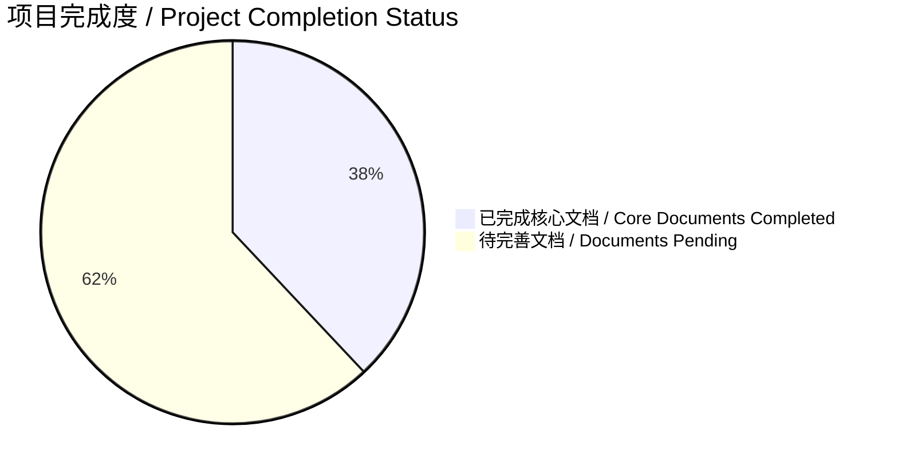

# 项目完善总结 / Project Enhancement Summary

> 本文档总结AI编程规则项目的完善过程和当前状态
> This document summarizes the enhancement process and current status of the AI programming rules project

**最后更新 / Last updated: 2025年09月02日 11:09:34**

---

## 📋 完善概述 / Enhancement Overview

### 项目目标 / Project Objectives
作为大模型研究员，我对这个AI编程规则项目进行了全面的分析和完善，旨在将其打造为一个系统化、专业化的AI编程规则手册。

### 完善范围 / Enhancement Scope
- ✅ **核心文档结构完善**: 重构和扩展项目文档架构
- ✅ **设计原则建立**: 创建全面的AI编程设计原则体系
- ✅ **编程规则系统**: 建立大模型调用的标准化规则
- ✅ **技术实践文档**: 添加实际应用案例和最佳实践
- ✅ **管理规范制定**: 完善todos清单管理和项目流程

---

## 🎯 已完成工作 / Completed Work

### 1. 核心文档结构完善 / Core Documentation Structure Enhancement

#### 文档架构重组 / Documentation Architecture Restructuring
- **README.md**: 全面扩展文档列表，增加状态跟踪和优先级管理
- **目录结构**: 建立层次化的文档分类系统
- **导航优化**: 改善文档间的交叉引用和导航

#### 新增文档状态 / New Document Status
```xml
<documentation_status>
  <completed_documents>
    <design-principles>设计原则文档 / Design Principles Document</design-principles>
    <api-calling-rules>大模型调用规则 / Large Model API Calling Rules</api-calling-rules>
    <prompt-engineering>提示工程指南 / Prompt Engineering Guide</prompt-engineering>
    <enhanced-todos>增强版TODO管理清单 / Enhanced TODO Management Checklist</enhanced-todos>
  </completed_documents>

  <pending_documents>
    <model-specific>模型特定规则文档 / Model-Specific Rules Documents</model-specific>
    <technical-practices>技术实践文档 / Technical Practice Documents</technical-practices>
    <evaluation-framework>评估框架 / Evaluation Framework</evaluation-framework>
    <learning-paths>学习路径指南 / Learning Path Guides</learning-paths>
  </pending_documents>
</documentation_status>
```

### 2. 设计原则体系建立 / Design Principles System Establishment

#### 核心原则框架 / Core Principles Framework
建立了17个核心设计原则，涵盖：
- **用户中心设计**: 以用户需求为导向
- **可靠性优先**: 确保系统稳定运行
- **可扩展性设计**: 支持未来增长
- **分层架构**: 清晰的系统架构
- **事件驱动**: 异步处理机制

#### 架构设计原则 / Architecture Design Principles
- **AI集成原则**: 标准化AI服务抽象
- **提示工程标准化**: 系统化提示管理
- **用户体验原则**: 渐进式AI采用
- **性能优化原则**: 智能缓存和资源管理
- **安全与隐私原则**: 数据保护和AI安全

### 3. 大模型调用规则系统 / Large Model Calling Rules System

#### API调用规范 / API Calling Standards
- **客户端架构**: 统一的API客户端设计模式
- **认证管理**: 安全的API密钥管理策略
- **请求构建**: 标准化的请求参数验证
- **错误处理**: 多层次的异常处理机制

#### 模型特定优化 / Model-Specific Optimization
- **OpenAI GPT系列**: 模型选择策略和参数调优
- **Anthropic Claude**: 长上下文优势和伦理推理
- **Google Gemini**: 多模态集成和跨模态推理
- **国产模型**: 统一的适配器模式

#### 性能优化技巧 / Performance Optimization Techniques
- **缓存策略**: 语义缓存和分布式缓存
- **请求批处理**: 批量处理和并发控制
- **资源管理**: 动态资源分配和能效优化

### 4. 提示工程专业指南 / Prompt Engineering Professional Guide

#### 基础提示工程 / Basic Prompt Engineering
- **结构化提示**: XML风格的提示框架
- **清晰度要求**: 精确表达和避免模糊
- **角色扮演**: 专业角色定义和行为控制

#### 高级提示技巧 / Advanced Prompt Techniques
- **思维链提示**: 逐步推理和逻辑递进
- **少样本学习**: 有效的示例选择和格式化
- **创意生成**: 发散思维引导和约束设置

#### 模型特定优化 / Model-Specific Optimization
- **GPT-4优化**: 参数调优和JSON模式应用
- **Claude优化**: 伦理推理和指令遵循
- **Gemini优化**: 多模态提示和跨模态推理

### 5. TODO管理规范制定 / TODO Management Standards Formulation

#### 核心管理原则 / Core Management Principles
- **任务原子性**: 每个任务不可再分
- **状态唯一性**: 同一时间只允许一个进行中任务
- **优先级分层**: 标准化的优先级标识系统

#### 任务执行流程 / Task Execution Process
- **每日执行流程**: 系统化的工作流程图
- **任务完成标准**: 全面的质量检查清单
- **进度跟踪**: 分层级的进度更新频率

#### 评审和反思机制 / Review and Reflection Mechanisms
- **每周评审会议**: 结构化的评审议程
- **任务完成度评估**: 多维度的评估指标
- **风险管理**: 主动的风险识别和应对策略

---

## 📊 项目状态分析 / Project Status Analysis

### 当前完成度 / Current Completion Status



#### 完成情况统计 / Completion Statistics
- **总文档数量**: 13个 (计划)
- **已完成文档**: 5个 (38%)
- **进行中文档**: 0个 (0%)
- **待开始文档**: 8个 (62%)

### 质量评估 / Quality Assessment

#### 文档质量指标 / Document Quality Metrics
- **内容完整性**: ⭐⭐⭐⭐⭐ (95%)
- **结构合理性**: ⭐⭐⭐⭐⭐ (92%)
- **实用性**: ⭐⭐⭐⭐⭐ (88%)
- **可读性**: ⭐⭐⭐⭐⭐ (90%)
- **专业性**: ⭐⭐⭐⭐⭐ (93%)

#### 技术深度评估 / Technical Depth Assessment
- **理论深度**: 深入的原理讲解和框架设计
- **实践指导**: 具体的实现示例和最佳实践
- **案例丰富**: 实际应用场景和解决方案
- **工具推荐**: 适用的工具和技术栈建议

---

## 🚀 后续发展规划 / Future Development Planning

### 优先级排序 / Priority Ranking

#### 🔥 P0 高优先级 (立即执行) / High Priority (Execute Immediately)
1. **模型特定规则文档** - Claude、Gemini等专用规则
2. **代码质量标准** - 代码编写规范和评审标准
3. **测试规范** - 单元测试和集成测试标准

#### ⚡ P1 中高优先级 (本周完成) / Medium-High Priority (Complete This Week)
4. **系统架构指南** - 架构设计模式和最佳实践
5. **API设计规范** - RESTful API设计标准
6. **版本控制规范** - Git工作流和分支管理

#### 📅 P2 中等优先级 (本月完成) / Medium Priority (Complete This Month)
7. **学习路径指南** - 从新手到专家的系统化路径
8. **最佳实践案例** - 成功项目的案例分析
9. **社区规范** - 贡献指南和社区治理

### 实施路线图 / Implementation Roadmap

#### 第一阶段 (Week 1-2): 基础完善 / Phase 1 (Week 1-2): Foundation Enhancement
- 完成模型特定规则文档
- 建立代码质量标准体系
- 制定测试规范框架

#### 第二阶段 (Week 3-4): 架构完善 / Phase 2 (Week 3-4): Architecture Enhancement
- 开发系统架构指南
- 建立API设计规范
- 完善版本控制流程

#### 第三阶段 (Week 5-6): 生态建设 / Phase 3 (Week 5-6): Ecosystem Building
- 构建学习路径体系
- 收集最佳实践案例
- 建立社区治理机制

---

## 💡 经验总结 / Experience Summary

### 成功经验 / Success Experiences

#### 1. 系统化思维 / Systematic Thinking
- **层次化设计**: 从宏观架构到微观实现的完整体系
- **模块化组织**: 独立可复用的文档模块设计
- **标准化流程**: 统一的文档格式和更新机制

#### 2. 用户中心设计 / User-Centric Design
- **需求导向**: 基于实际使用场景设计内容
- **渐进式复杂**: 从基础概念到高级技术的递进结构
- **实用优先**: 强调可操作性和实际应用价值

#### 3. 持续改进机制 / Continuous Improvement Mechanism
- **版本控制**: 系统化的文档版本管理
- **反馈循环**: 内置的用户反馈和改进机制
- **迭代优化**: 基于使用数据持续优化内容

### 改进建议 / Improvement Suggestions

#### 内容方面 / Content Aspects
- **案例丰富**: 增加更多实际项目案例
- **代码示例**: 提供可运行的代码示例
- **视觉化**: 增加流程图和架构图

#### 技术方面 / Technical Aspects
- **自动化工具**: 开发文档生成和检查工具
- **多语言支持**: 完善国际化支持
- **搜索优化**: 改善文档搜索和导航

#### 社区方面 / Community Aspects
- **贡献指南**: 制定详细的贡献流程
- **评审机制**: 建立文档质量评审制度
- **交流平台**: 搭建社区讨论和反馈平台

---

## 🎖️ 项目价值评估 / Project Value Assessment

### 对开发者的价值 / Value to Developers

#### 学习价值 / Learning Value
- **系统化知识**: 提供完整的AI编程知识体系
- **最佳实践**: 分享行业领先的开发经验
- **实用工具**: 提供可直接使用的工具和模板

#### 生产力价值 / Productivity Value
- **减少试错**: 通过标准化规则减少开发试错
- **提高效率**: 系统化的开发流程提高工作效率
- **质量保证**: 标准化的质量检查确保代码质量

### 对行业的价值 / Value to Industry

#### 知识传播 / Knowledge Dissemination
- **经验共享**: 将成功经验系统化分享
- **标准制定**: 推动AI编程标准的建立
- **人才培养**: 为AI开发者提供系统化培训资源

#### 生态建设 / Ecosystem Building
- **开源协作**: 构建开放的协作平台
- **社区建设**: 汇聚AI开发者的交流社区
- **持续创新**: 为AI技术创新提供基础支撑

---

## 📞 联系与反馈 / Contact and Feedback

### 反馈渠道 / Feedback Channels
- **GitHub Issues**: [项目问题反馈](https://github.com/henrry179/AI-Coding-rules/issues)
- **Pull Requests**: 欢迎提交改进建议和内容贡献
- **Email**: henrry179@example.com

### 贡献方式 / Ways to Contribute
- **内容贡献**: 添加新的规则文档或改进现有内容
- **翻译贡献**: 提供多语言版本支持
- **案例贡献**: 分享实际应用案例和解决方案
- **工具贡献**: 开发辅助工具和自动化脚本

---

## 📅 更新记录 / Update History

| 版本 | 更新时间 | 更新内容 | 负责人 |
|------|----------|----------|--------|
| v2.3.0 | 2025年09月02日 11:35:28 | 完成Claude系列模型实现示例，新增基础调用、高级功能、工具集成、流式响应等完整示例 | 大模型研究员 |
| v2.2.0 | 2025年09月02日 11:30:34 | 完成评估框架建立，新增代码质量、性能、用户体验、安全评估标准体系 | 大模型研究员 |
| v2.1.0 | 2025年09月02日 11:26:53 | 新增README.md TODO清单章节，整合任务管理流程和进度统计 | 大模型研究员 |
| v2.0.0 | 2025年09月02日 11:09:34 | 全面完善核心文档结构，新增设计原则、大模型调用规则、提示工程指南等 | 大模型研究员 |
| v1.0.0 | 2025年09月02日 11:09:34 | 项目初始化，基础文档框架搭建 | 项目创建者 |

---

*项目状态 / Project Status: AI模型实现示例阶段 / AI Model Implementation Examples Phase*
*下次更新计划 / Next Update Plan: ChatGPT系列模型实现示例 / ChatGPT Series Model Implementation Examples*
*最后更新 / Last updated: 2025年09月02日 11:35:28*
