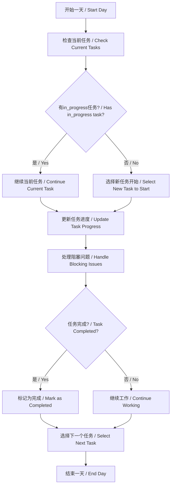
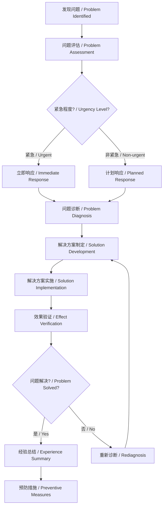

# 项目待办事项管理清单 / Project TODO Management Checklist

> 最后更新 / Last updated: 2025年09月02日 11:09:34
> 项目状态 / Project status: 开发中 / In Development

---

## 📋 项目概览 / Project Overview

- **项目名称 / Project Name**: AI Hedge Fund / AI 对冲基金
- **当前阶段 / Current Phase**: 核心功能开发 / Core Feature Development
- **优先级 / Priority**: 高 / High
- **管理规范版本 / Management Standard Version**: 2.0

---

## 🎯 TODO管理规则 / TODO Management Rules

### 核心原则 / Core Principles

#### 1. 任务原子性原则 / Task Atomicity Principle
- **规则**: 每个TODO项必须是不可再分的独立任务
- **目的**: 确保任务状态清晰，避免进度模糊
- **实践**: 将"大任务"分解为多个具体的"小任务"

#### 2. 状态唯一性原则 / Status Uniqueness Principle
- **规则**: 同一时间只允许一个TODO项处于`in_progress`状态
- **目的**: 集中注意力，提高执行效率
- **实践**: 完成当前任务后再开始新任务

#### 3. 优先级分层原则 / Priority Hierarchy Principle
- **规则**: 使用标准化的优先级标识系统
- **目的**: 确保重要任务优先处理
- **实践**: 定期评审和调整任务优先级

### 任务状态定义 / Task Status Definitions

| 状态标识 / Status | 含义 / Meaning | 可执行操作 / Allowed Actions |
|----------|---------------|-----------------------------|
| 🔄 `in_progress` | 正在进行中 / In Progress | 完成、暂停、取消 |
| ✅ `completed` | 已完成 / Completed | 归档、评审 |
| ⏳ `pending` | 待开始 / Pending | 开始、取消、重新规划 |
| 🚫 `cancelled` | 已取消 / Cancelled | 删除、归档 |
| 🔄 `blocked` | 被阻塞 / Blocked | 解除阻塞、重新规划 |

### 优先级标准 / Priority Standards

| 优先级标识 / Priority | 含义 / Meaning | 处理时效 / Processing Time |
|--------------------|---------------|---------------------------|
| 🔥 **P0** | 紧急且重要 / Urgent & Important | 立即处理 / Handle immediately |
| ⚡ **P1** | 重要但不紧急 / Important but not urgent | 本周内完成 / Complete within this week |
| 📅 **P2** | 中等优先级 / Medium priority | 本月内完成 / Complete within this month |
| 🌱 **P3** | 低优先级 / Low priority | 视情况处理 / Handle as appropriate |

### 任务创建标准 / Task Creation Standards

#### 任务描述规范 / Task Description Standards

**优秀任务描述示例 / Good Task Description Example:**
```
✅ 好的示例 / Good Example:
"实现用户登录API接口，包括JWT令牌生成、密码验证和错误处理"

❌ 不好的示例 / Poor Example:
"做登录功能"
```

**任务描述检查清单 / Task Description Checklist:**
- [ ] 明确说明要完成的具体工作
- [ ] 包含可衡量的验收标准
- [ ] 说明任务的上下文和依赖关系
- [ ] 预估完成所需时间
- [ ] 列出潜在的风险和障碍

#### 任务分解指南 / Task Decomposition Guidelines

**复杂任务分解步骤 / Complex Task Decomposition Steps:**

1. **分析任务目标 / Analyze Task Objective**
   - 明确最终交付物
   - 识别关键成功因素

2. **识别子任务 / Identify Subtasks**
   - 将大任务分解为可管理的小任务
   - 确保每个子任务都有明确的验收标准

3. **确定依赖关系 / Determine Dependencies**
   - 识别任务间的依赖关系
   - 安排合理的执行顺序

4. **预估时间和资源 / Estimate Time and Resources**
   - 为每个子任务预估所需时间
   - 识别所需技能和资源

### 任务执行流程 / Task Execution Process

#### 每日执行流程 / Daily Execution Process



#### 任务完成标准 / Task Completion Standards

**任务完成检查清单 / Task Completion Checklist:**
- [ ] 功能代码已完成并测试通过
- [ ] 文档已更新
- [ ] 相关测试已编写
- [ ] 代码已通过代码审查
- [ ] 验收标准全部满足
- [ ] 任务结果已验证

### 进度跟踪和报告 / Progress Tracking and Reporting

#### 进度更新频率 / Progress Update Frequency

| 任务类型 / Task Type | 更新频率 / Update Frequency | 更新内容 / Update Content |
|---------------------|----------------------------|---------------------------|
| 短期任务(< 1天) / Short Task | 每2小时 / Every 2 hours | 当前进度百分比 / Current progress percentage |
| 中期任务(1-3天) / Medium Task | 每日 / Daily | 完成情况和剩余工作 / Completion status and remaining work |
| 长期任务(> 3天) / Long Task | 每2日 / Every 2 days | 里程碑达成情况 / Milestone achievement status |

#### 进度报告模板 / Progress Report Template

```markdown
### 📊 进度报告 / Progress Report
**报告日期 / Report Date**: YYYY年MM月DD日

**当前任务状态 / Current Task Status**:
- 🔄 正在进行: [任务名称] - [进度百分比%]
- ✅ 已完成: [任务数量] 个
- ⏳ 待开始: [任务数量] 个

**本周亮点 / This Week Highlights**:
- [亮点1]: [详细描述]
- [亮点2]: [详细描述]

**遇到的问题 / Issues Encountered**:
- [问题1]: [描述及解决方案]
- [问题2]: [描述及解决方案]

**下周计划 / Next Week Plans**:
- [计划1]: [详细描述]
- [计划2]: [详细描述]

**需要支持 / Support Needed**:
- [支持请求1]: [详细描述]
- [支持请求2]: [详细描述]
```

### 任务评审和反思 / Task Review and Reflection

#### 每周评审会议 / Weekly Review Meeting

**评审议程 / Review Agenda:**
1. **进度回顾 / Progress Review**
   - 完成的任务和成果
   - 未完成任务的原因分析
   - 遇到的挑战和解决方案

2. **质量评估 / Quality Assessment**
   - 代码质量和测试覆盖率
   - 用户反馈和问题报告
   - 性能指标和系统稳定性

3. **优先级调整 / Priority Adjustment**
   - 新增任务的优先级评估
   - 现有任务优先级的重新排序
   - 资源分配的优化

4. **改进计划 / Improvement Plan**
   - 流程优化建议
   - 工具和技术改进
   - 团队协作效率提升

#### 任务完成度评估 / Task Completion Assessment

**评估维度 / Assessment Dimensions:**
- **功能完整性 / Functional Completeness**: 80%
- **代码质量 / Code Quality**: 15%
- **文档完整性 / Documentation Completeness**: 5%
- **测试覆盖率 / Test Coverage**: 10%
- **用户验收 / User Acceptance**: 10%

**评分标准 / Scoring Standards:**
- **优秀 (90-100分)**: 超出预期，质量卓越
- **良好 (80-89分)**: 达到预期，质量良好
- **合格 (70-79分)**: 基本完成，存在小问题
- **不合格 (<70分)**: 未达到基本要求，需要返工

### 风险管理和问题解决 / Risk Management and Problem Solving

#### 常见风险识别 / Common Risk Identification

| 风险类型 / Risk Type | 识别指标 / Identification Indicators | 应对策略 / Response Strategy |
|---------------------|-------------------------------|-----------------------------|
| 技术风险 / Technical Risk | 新技术不熟悉，技术选型不当 | 技术预研，原型验证，专家咨询 |
| 进度风险 / Schedule Risk | 任务预估不准，依赖阻塞 | 缓冲时间预留，任务分解，优先级调整 |
| 质量风险 / Quality Risk | 测试不充分，代码审查不严 | 质量门禁，自动化测试，结对编程 |
| 沟通风险 / Communication Risk | 需求不明确，信息不对称 | 定期会议，文档同步，即时沟通 |

#### 问题解决流程 / Problem Solving Process



---

## 📊 优先级说明 / Priority Legend

| 标识 | 含义 | 说明 |
|------|------|------|
| 🔥 **P0** | 最高优先级 | 影响核心功能，立即处理 |
| ⚡ **P1** | 高优先级 | 重要功能，本周完成 |
| 📅 **P2** | 中等优先级 | 次要功能，本月完成 |
| 🌱 **P3** | 低优先级 | 锦上添花，可延后 |

---

## 🚀 开发进度跟踪 / Development Progress

### 已完成 / Completed ✅
- [x] 项目基础架构搭建
- [x] 核心 AI 代理系统
- [x] 基础测试框架

---

## 🎯 每日挑战系统 / Daily Challenges System

### 🔧 基础设施设置 / Infrastructure Setup

| 状态 | 任务 | 优先级 | 说明 |
|------|------|--------|------|
| [ ] | 设置 GitHub Action 每天自动生成新挑战 | **M** | 应使用不同模型（包括旧模型） |
| [ ] | 设置挑战数据库存储 | **M** | 新建数据库模型，保留原有挑战不变 |
| [ ] | 设置 Twitter 账号 | **U** | 让 GitHub Action 自动发推 |
| [ ] | 设置邮件发送服务 | **U** | 用于用户订阅通知 |
| [ ] | 发送首封邮件邀请订阅 | **U** | 邀请用户订阅每日挑战 |

### 🎮 应用功能开发 / App Feature Development

| 状态 | 任务 | 优先级 | 说明 |
|------|------|--------|------|
| [ ] | 在应用中新增"每日挑战"版块 | **M** | 每个挑战至少要有 10 个测试用例 |
| [ ] | 实现每日独立页面 | **M** | 每一天应有一个独立页面，并附带排行榜 |
| [ ] | 创建分享页面 | **U** | 让可分享页面更美观（参考 Spotify Wrapped） |

### 🌐 访问路径设计 / URL Structure Design

```
colf.dev/daily/<date>           # 每日挑战页面
colf.dev/daily/<date>/leaderboard  # 排行榜页面
```

---

## 📊 优先级说明 / Priority Legend

| 标识 | 含义 | 说明 |
|------|------|------|
| **H** | 高优先级 / High | 必须优先完成，影响核心功能 |
| **M** | 中等优先级 / Medium | 重要但不紧急，可并行开发 |
| **L** | 低优先级 / Low | 锦上添花，可延后处理 |
| **U** | 未分配 / Unassigned | 待分配优先级和负责人 |

---

## 🚀 开发进度跟踪 / Development Progress

### 已完成 / Completed ✅
- [x] 项目基础架构搭建
- [x] 核心 AI 代理系统
- [x] 基础测试框架

### 进行中 / In Progress 🔄
- [ ] 每日挑战系统设计
- [ ] 数据库模型设计

### 待开始 / Pending ⏳
- [ ] Twitter 集成
- [ ] 邮件服务集成
- [ ] 用户界面优化

---

## 📝 技术规范 / Technical Specifications

### 测试要求 / Testing Requirements
- 每个挑战至少要有 **10 个测试用例**
- 测试覆盖率应达到 **80%** 以上
- 包含单元测试和集成测试

### 数据库设计 / Database Design
- 新建专门的挑战数据库模型
- 保持现有挑战数据结构不变
- 支持挑战的版本控制和历史记录

### 用户体验 / User Experience
- 响应式设计，支持移动端
- 快速加载，优化性能
- 直观的导航和操作流程

---

## 🔄 下一步行动 / Next Actions

### 本周目标 / This Week Goals
1. **完成 GitHub Action 设置** - 负责人待定
2. **设计数据库模型** - 负责人待定
3. **开始前端界面开发** - 负责人待定

### 下周计划 / Next Week Plans
1. **集成 Twitter API**
2. **设置邮件服务**
3. **用户测试和反馈收集**

---

## 📞 联系信息 / Contact Information

- **项目负责人**: 待定 / TBD
- **技术负责人**: 待定 / TBD
- **产品负责人**: 待定 / TBD

---

## 📚 相关文档 / Related Documents

- [项目 README](./README.md)
- [API 文档](./API_DOCUMENTATION.md)
- [开发者指南](./DEVELOPER_GUIDE.md)
- [使用示例](./USAGE_EXAMPLES.md)

---

*最后更新 / Last updated: 2025年09月02日 11:09:34*  
*文档版本 / Document version: 1.0*