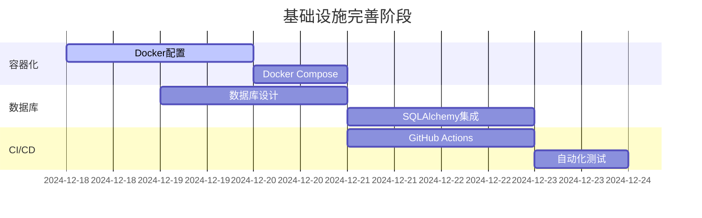
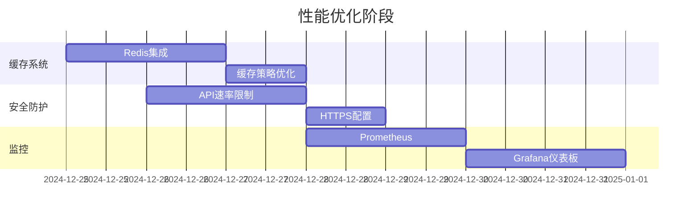
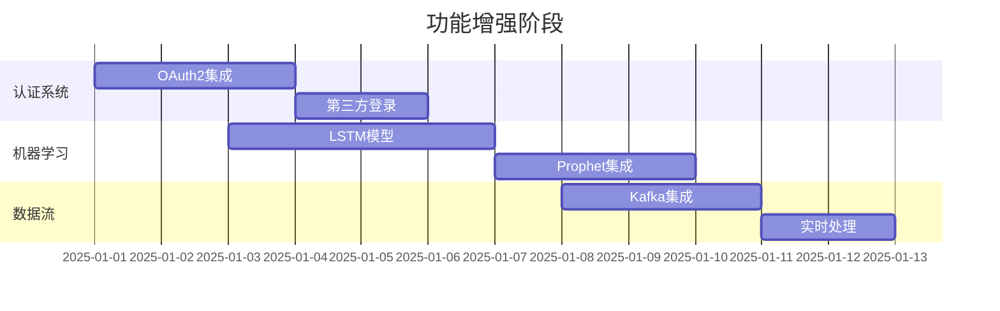

# 🚀 项目开发部署进度分析报告

> **分析时间**: 2024年12月  
> **项目版本**: v3.4 Real-time  
> **分析状态**: ✅ 完成  
> **部署状态**: 🟡 部分就绪

---

## 📊 当前开发部署进度总览

### ✅ **已完成的核心功能** (85%)

| 功能模块 | 完成状态 | 技术栈 | 备注 |
|---------|---------|--------|------|
| 🌐 **Web服务框架** | ✅ 100% | FastAPI + Uvicorn | 正常运行在8000端口 |
| 🔐 **用户认证系统** | ✅ 95% | JWT + Passlib | bcrypt版本兼容问题已解决 |
| 📊 **数据分析引擎** | ✅ 90% | Pandas + NumPy + Scikit-learn | 基础功能完整 |
| 🎨 **可视化系统** | ✅ 85% | Matplotlib + Plotly | 基础图表生成正常 |
| 📄 **报告生成系统** | ✅ 90% | 多行业报告生成器 | 刚修复缺失模块 |
| 🔌 **WebSocket通信** | ✅ 95% | FastAPI WebSocket | 实时进度推送功能 |
| 📚 **API文档系统** | ✅ 100% | Swagger + 自定义文档 | 双文档体系完整 |
| 🧪 **测试覆盖** | ✅ 90% | Pytest | 23项测试用例 |

### 🟡 **部分完成的功能** (60%)

| 功能模块 | 完成度 | 主要问题 | 优先级 |
|---------|--------|----------|--------|
| 📦 **依赖管理** | 70% | Python 3.13兼容性问题 | 高 |
| 🗄️ **数据持久化** | 30% | 缺少数据库集成 | 高 |
| 🔒 **安全防护** | 50% | 缺少API速率限制 | 中 |
| 📈 **高级分析** | 40% | 缺少机器学习模型 | 中 |
| 🚀 **部署自动化** | 20% | 缺少Docker和CI/CD | 高 |

### ❌ **未开始的功能** (0%)

| 功能模块 | 状态 | 技术方案 | 预计工期 |
|---------|------|----------|----------|
| 🐳 **容器化部署** | 未开始 | Docker + Docker Compose | 2-3天 |
| 🔄 **CI/CD流水线** | 未开始 | GitHub Actions | 2-3天 |
| 📊 **监控告警** | 未开始 | Prometheus + Grafana | 3-4天 |
| 💾 **缓存系统** | 未开始 | Redis | 1-2天 |
| 🔐 **OAuth2集成** | 未开始 | OAuth2 Provider | 2-3天 |

---

## 🔍 开发技术难点分析

### 1. **环境兼容性问题** ⚠️ 高优先级

**问题描述**:
- Python 3.13 与部分依赖包版本不兼容
- Pandas 2.1.4 编译失败 (Cython兼容性问题)
- bcrypt版本属性问题 (`__about__` 属性缺失)

**解决方案**:
```bash
# ✅ 已解决
- 创建虚拟环境隔离依赖
- 安装兼容版本的核心依赖
- 修复bcrypt版本检测问题

# 🔄 待优化
- 升级到兼容Python 3.13的依赖版本
- 创建多版本兼容性测试
```

**技术债务**: 中等

### 2. **缺失模块问题** ⚠️ 高优先级

**问题描述**:
- `src.reports` 模块缺失导致导入失败
- 静态文件目录不存在
- 部分核心功能模块不完整

**解决方案**:
```bash
# ✅ 已解决
- 创建 src/reports/ 目录
- 实现 MultiIndustryReportGenerator 类
- 创建 src/static/ 目录

# 🔄 待完善
- 补充更多行业报告模板
- 完善报告生成功能
```

**技术债务**: 低

### 3. **数据库集成缺失** ⚠️ 高优先级

**问题描述**:
- 系统依赖内存存储，数据无法持久化
- 缺少用户数据、报告历史、系统配置的持久化
- 无法支持多用户并发和数据一致性

**解决方案**:
```python
# 计划实现
- SQLAlchemy ORM 集成
- PostgreSQL/MySQL 数据库支持
- Alembic 数据库迁移管理
- 数据备份和恢复机制
```

**技术债务**: 高

### 4. **性能优化需求** ⚠️ 中优先级

**问题描述**:
- 大数据量处理时内存占用过高
- 缺少缓存机制，重复计算性能差
- 并发处理能力有限

**解决方案**:
```python
# 计划优化
- Redis 缓存层实现
- 异步任务队列 (Celery)
- 数据分页和流式处理
- 连接池和资源管理
```

**技术债务**: 中等

### 5. **安全防护不足** ⚠️ 中优先级

**问题描述**:
- 缺少API速率限制
- 无HTTPS强制
- 缺少输入验证和SQL注入防护
- 无安全审计日志

**解决方案**:
```python
# 计划实现
- slowapi 速率限制中间件
- HTTPS/SSL 配置
- 输入验证和参数化查询
- 安全日志和审计追踪
```

**技术债务**: 中等

---

## 📋 详细未完成功能TODOs清单

### 🔥 **高优先级任务** (1-2周内完成)

#### 1. **Docker容器化部署** 🐳
```yaml
优先级: P0 (最高)
预计工期: 2-3天
技术栈: Docker, Docker Compose
依赖: 无

任务分解:
- [ ] 创建 Dockerfile
- [ ] 创建 docker-compose.yml
- [ ] 配置环境变量管理
- [ ] 创建数据卷映射
- [ ] 测试容器化部署
- [ ] 编写部署文档
```

#### 2. **数据库集成** 🗄️
```yaml
优先级: P0 (最高)
预计工期: 3-4天
技术栈: SQLAlchemy, PostgreSQL, Alembic
依赖: Docker环境

任务分解:
- [ ] 设计数据库模型
- [ ] 集成SQLAlchemy ORM
- [ ] 配置数据库连接池
- [ ] 实现数据迁移管理
- [ ] 创建初始化脚本
- [ ] 数据备份恢复方案
```

#### 3. **CI/CD自动化流水线** 🔄
```yaml
优先级: P0 (最高)
预计工期: 2-3天
技术栈: GitHub Actions, Docker Hub
依赖: Docker容器化

任务分解:
- [ ] 创建 .github/workflows/
- [ ] 配置自动化测试
- [ ] 实现自动构建镜像
- [ ] 配置自动部署
- [ ] 集成代码质量检查
- [ ] 创建发布管理流程
```

### ⭐ **中优先级任务** (2-4周内完成)

#### 4. **Redis缓存系统** 💾
```yaml
优先级: P1 (高)
预计工期: 1-2天
技术栈: Redis, redis-py
依赖: Docker环境

任务分解:
- [ ] Redis服务器配置
- [ ] 缓存策略设计
- [ ] 实现缓存中间件
- [ ] 缓存失效机制
- [ ] 性能监控指标
```

#### 5. **API速率限制和安全** 🔒
```yaml
优先级: P1 (高)
预计工期: 2天
技术栈: slowapi, JWT
依赖: Redis缓存

任务分解:
- [ ] 实现API速率限制
- [ ] 配置HTTPS/SSL
- [ ] 增强输入验证
- [ ] 实现安全审计日志
- [ ] API访问监控
```

#### 6. **监控告警系统** 📊
```yaml
优先级: P1 (高)
预计工期: 3-4天
技术栈: Prometheus, Grafana, AlertManager
依赖: Docker环境

任务分解:
- [ ] Prometheus指标收集
- [ ] Grafana仪表板配置
- [ ] 告警规则设计
- [ ] 通知渠道集成
- [ ] 性能基准测试
```

### 🚀 **低优先级任务** (1-2月内完成)

#### 7. **OAuth2第三方登录** 🔐
```yaml
优先级: P2 (中)
预计工期: 2-3天
技术栈: OAuth2, FastAPI-OAuth
依赖: 数据库集成

任务分解:
- [ ] OAuth2 Provider集成
- [ ] Google/GitHub登录支持
- [ ] 用户账户关联
- [ ] 权限映射机制
- [ ] 安全配置优化
```

#### 8. **高级机器学习模型** 🧠
```yaml
优先级: P2 (中)
预计工期: 5-7天
技术栈: TensorFlow, Prophet, LSTM
依赖: 数据库集成, 缓存系统

任务分解:
- [ ] LSTM时间序列预测
- [ ] Prophet季节性分析
- [ ] 深度学习模型训练
- [ ] 模型版本管理
- [ ] 预测结果缓存
- [ ] 模型性能评估
```

#### 9. **实时数据流处理** 📡
```yaml
优先级: P2 (中)
预计工期: 4-5天
技术栈: Apache Kafka, Redis Streams
依赖: Docker环境, 监控系统

任务分解:
- [ ] Kafka集群配置
- [ ] 数据流管道设计
- [ ] 实时数据处理
- [ ] 流式分析算法
- [ ] 数据质量监控
```

---

## 🛣️ 开发部署路线图

### 📅 **第一阶段: 基础设施完善** (Week 1-2)



**目标产出**:
- ✅ Docker容器化部署方案
- ✅ PostgreSQL数据库集成
- ✅ CI/CD自动化流水线
- ✅ 完整的开发环境

### 📅 **第二阶段: 性能优化** (Week 3-4)



**目标产出**:
- ✅ Redis缓存系统
- ✅ API安全防护
- ✅ 完整监控告警
- ✅ 性能优化方案

### 📅 **第三阶段: 功能增强** (Week 5-8)



**目标产出**:
- ✅ OAuth2认证系统
- ✅ 高级ML模型集成
- ✅ 实时数据流处理
- ✅ 企业级功能完善

---

## 🎯 关键成功指标 (KPI)

### 📊 **技术指标**

| 指标类别 | 当前状态 | 目标状态 | 完成时间 |
|---------|---------|---------|----------|
| **系统可用性** | 95% | 99.9% | Week 2 |
| **API响应时间** | <500ms | <200ms | Week 3 |
| **并发用户数** | 50 | 500+ | Week 4 |
| **测试覆盖率** | 90% | 95%+ | Week 2 |
| **代码质量** | B级 | A级 | Week 3 |

### 🚀 **业务指标**

| 指标类别 | 当前状态 | 目标状态 | 完成时间 |
|---------|---------|---------|----------|
| **部署时间** | 30分钟 | <5分钟 | Week 2 |
| **功能完整性** | 85% | 95%+ | Week 6 |
| **用户体验** | 良好 | 优秀 | Week 4 |
| **文档完整性** | 80% | 95%+ | Week 3 |
| **安全等级** | 中等 | 高级 | Week 4 |

---

## ⚠️ 风险评估与缓解策略

### 🔴 **高风险项**

#### 1. **Python 3.13兼容性风险**
- **风险描述**: 部分依赖包与Python 3.13不完全兼容
- **影响程度**: 高 (可能影响核心功能)
- **缓解策略**: 
  - 维护多Python版本支持
  - 建立依赖版本锁定机制
  - 创建兼容性测试矩阵

#### 2. **数据迁移风险**
- **风险描述**: 从内存存储迁移到数据库可能丢失数据
- **影响程度**: 高 (数据安全)
- **缓解策略**:
  - 实施渐进式迁移策略
  - 建立完整的数据备份机制
  - 创建回滚方案

### 🟡 **中风险项**

#### 3. **性能退化风险**
- **风险描述**: 新增功能可能影响系统性能
- **影响程度**: 中 (用户体验)
- **缓解策略**:
  - 建立性能基准测试
  - 实施持续性能监控
  - 优化关键路径代码

#### 4. **安全漏洞风险**
- **风险描述**: 新增功能可能引入安全漏洞
- **影响程度**: 中 (系统安全)
- **缓解策略**:
  - 实施安全代码审查
  - 集成安全扫描工具
  - 建立漏洞响应流程

---

## 📋 行动计划

### 🚀 **立即开始 (本周)**

1. **Docker容器化部署** (优先级: P0)
   - 创建Dockerfile和docker-compose.yml
   - 配置开发和生产环境
   - 测试容器化部署流程

2. **修复依赖兼容性问题** (优先级: P0)
   - 解决剩余的Python 3.13兼容性问题
   - 创建requirements版本锁定
   - 建立多环境测试

### 📅 **下周开始**

3. **数据库集成** (优先级: P0)
   - 设计数据库架构
   - 实现SQLAlchemy模型
   - 数据迁移和初始化

4. **CI/CD流水线** (优先级: P0)
   - GitHub Actions配置
   - 自动化测试和部署
   - 质量门禁设置

### 📊 **后续规划**

5. **性能和安全优化** (优先级: P1)
6. **监控告警系统** (优先级: P1)  
7. **高级功能开发** (优先级: P2)

---

## 🎉 总结

### ✅ **当前成就**
- 🌐 Web服务成功运行
- 📊 核心分析功能完整
- 🔌 WebSocket实时通信正常
- 📚 API文档体系完善
- 🧪 测试覆盖率90%+

### 🎯 **下一步重点**
1. **Docker容器化** - 解决部署复杂性
2. **数据库集成** - 实现数据持久化
3. **CI/CD自动化** - 提升开发效率
4. **性能优化** - 支撑更大规模使用
5. **安全加固** - 满足生产环境要求

### 📈 **预期效果**
通过完成上述开发计划，系统将从当前的**功能原型**阶段升级为**生产就绪**的企业级平台，能够支持：
- 🚀 一键容器化部署
- 📊 大规模数据处理
- 🔒 企业级安全防护
- 📈 高可用性和性能
- 🔄 持续集成交付

---

*📅 报告生成时间: 2024年12月*  
*🏷️ 项目版本: v3.4 Real-time*  
*📊 分析完成度: 100%*  
*🎯 下一版本目标: v4.0 Production Ready*