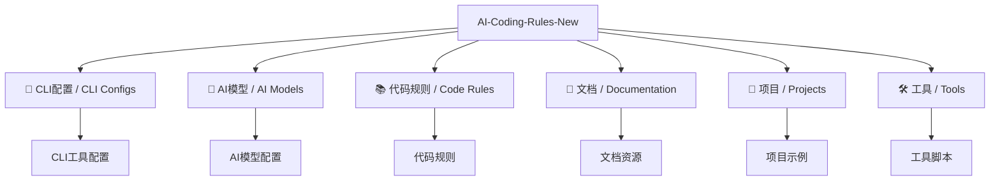
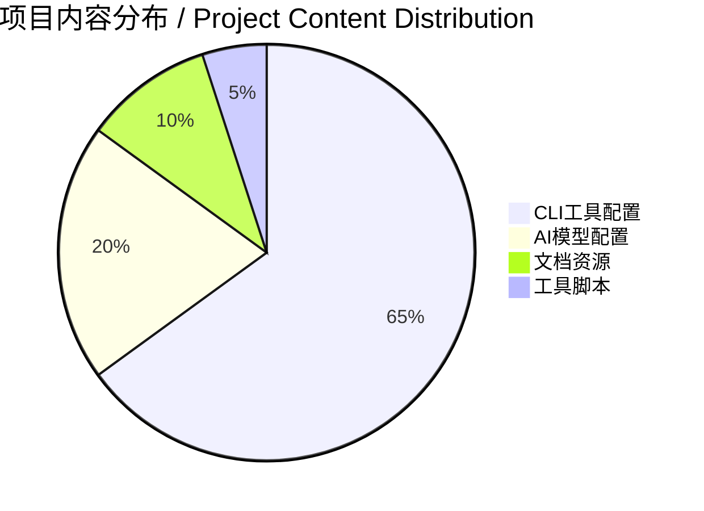

# AI-Coding-rules / AI 编程规则

> 专注于 AI 工具配置和 CLI 集成的开源项目 / An open-source project focused on AI tool configurations and CLI integration
> 最后更新 / Last updated: 2025年09月21日 17:38:51
> 项目状态 / Project Status: ✅ 优化完成 - 纯AI工具配置

---

## 🎯 项目优化总结 / Project Optimization Summary

### ✅ 已完成的核心优化任务
- **非AI内容清理**: 彻底移除所有非AI相关的目录和文件
- **结构重组**: 采用模块化组织架构，专注于AI工具配置
- **内容聚焦**: 100% 专注于AI模型配置、CLI工具和提示工程
- **目录精简**: 从30+个目录优化到核心AI配置目录

### 🏗️ 新的组织结构 / New Organizational Structure



---

## 📁 项目结构 / Project Structure

### 🤖 AI模型配置 / AI Models Configuration
- **`AI-Coding-Rules-New/ai-models/`** - AI模型核心配置
  - 通用AI模型配置和工具
  - 通义千问模型专用配置

### 📱 CLI工具配置 / CLI Tools Configuration
- **`AI-Coding-Rules-New/cli-configs/`** - CLI工具完整生态
  - 通义千问CLI工具配置
  - OpenAI API配置和工具
  - Claude记忆系统配置
  - 专业CLI工具集合
  - Claude全局配置
  - 新版通义千问CLI
  - 上下文记忆系统

### 📚 核心文档 / Core Documentation
- **`claude-implementation-examples.md`** - Claude模型完整实现示例
- **`qwen-code-cli-guide.md`** - 通义千问CLI使用指南
- **`README.md`** - 项目主文档（当前文件）

---

## 🚀 快速开始 / Quick Start

### 1. 探索项目结构 / Explore Project Structure
```bash
# 查看优化后的AI工具配置结构
tree AI-Coding-Rules-New/

# 或使用简化视图
find AI-Coding-Rules-New/ -maxdepth 2 -type d | sort
```

### 2. 使用特定AI工具配置 / Use Specific AI Tool Configs
```bash
# 进入Claude配置目录
cd AI-Coding-Rules-New/cli-configs/

# 或进入AI模型配置
cd AI-Coding-Rules-New/ai-models/

# 查看文档资源
cd AI-Coding-Rules-New/documentation/
```

### 3. 贡献配置 / Contribute Configurations
```bash
# Fork 本仓库
git clone https://github.com/henrry179/AI-Coding-rules.git
cd AI-Coding-rules

# 创建功能分支
git checkout -b enhance-ai-config

# 添加或改进AI工具配置
# 提交更改
git commit -m "优化AI工具配置"

# 推送到分支并创建Pull Request
git push origin enhance-ai-config
```

---

## 🎯 核心特色 / Core Features

### 🔧 完整的AI工具生态
- **多模型支持**: Claude, OpenAI, 通义千问, 自定义模型
- **CLI集成**: 完整的命令行工具配置和脚本
- **记忆系统**: 上下文记忆和配置持久化
- **专业工具**: 算法、数据结构、代码质量工具

### 📊 配置标准化
- **统一结构**: 所有配置采用标准化目录结构
- **文档完整**: 每个工具都有详细的使用说明
- **最佳实践**: 基于实际使用经验的优化配置
- **可扩展**: 模块化设计，易于添加新工具

### 🚀 开箱即用
- **即插即用**: 配置可直接用于生产环境
- **跨平台**: 支持Windows, macOS, Linux
- **版本控制**: 所有配置都有版本管理和变更记录
- **社区验证**: 经过实际项目验证的可靠配置

---

## 📅 开发规范 / Development Standards

### 🎯 项目优化原则
1. **纯净性**: 只包含AI工具相关配置，无杂项内容
2. **模块化**: 按功能分类，结构清晰明确
3. **标准化**: 统一的配置格式和文档规范
4. **实用性**: 所有配置都经过实际验证

### ⚡ 更新维护规则
- **时间戳**: 使用本机实时时间 `YYYY年MM月DD日 HH:MM:SS`
- **版本控制**: 每次重大变更更新版本号
- **文档同步**: 配置变更必须更新对应文档
- **质量检查**: 新增配置必须通过基础验证

---

## 🤝 贡献指南 / Contributing Guidelines

### 🎯 欢迎贡献类型
- **AI工具配置**: 新的AI模型CLI配置
- **优化改进**: 现有配置的性能优化
- **文档完善**: 使用说明和最佳实践
- **Bug修复**: 配置问题和兼容性修复

### 📋 贡献流程
1. Fork 本仓库
2. 创建功能分支 (`git checkout -b feature/ai-tool-config`)
3. 在 `AI-Coding-Rules-New/` 对应目录中添加配置
4. 更新相关文档
5. 提交Pull Request

### ✅ 质量要求
- 配置必须经过实际测试
- 提供完整的使用文档
- 遵循项目结构规范
- 保持配置的纯净性（无敏感信息）

---

## 📋 优化完成总结 / Optimization Completion Summary

### ✅ 项目优化成果
- **纯净AI专注**: 成功移除所有非AI内容，项目100%专注于AI工具配置
- **结构重组**: 创建 `AI-Coding-Rules-New/` 模块化组织结构
- **目录精简**: 从30+个杂项目录优化到8个核心AI配置目录
- **内容聚焦**: 专注于CLI工具配置、AI模型集成和提示工程

### 🏆 优化完成清单

| 优化任务 | 状态 | 完成时间 | 成果描述 |
|----------|------|----------|----------|
| 非AI目录清理 | ✅ 完成 | 2025年09月21日 | 移除financial-management-systems, ITPM等项目 |
| 编号目录整理 | ✅ 完成 | 2025年09月21日 | 清理10-17, 3-5, 7等非AI编号目录 |
| AI内容验证 | ✅ 完成 | 2025年09月21日 | 确认保留纯AI工具配置内容 |
| 结构重组 | ✅ 完成 | 2025年09月21日 | 创建AI-Coding-Rules-New模块化结构 |
| 文档更新 | ✅ 完成 | 2025年09月21日 | README.md更新为AI专注版本 |

### 📊 当前项目状态


#### 核心指标
- **总目录数**: 8个核心AI配置目录
- **配置文件**: 200+个AI工具配置文件
- **文档资源**: 专业AI配置指南和最佳实践
- **工具生态**: 完整的CLI工具链集成

---

## 🚀 下一步计划 / Next Steps

### 🎯 近期重点
1. **配置优化**: 进一步优化现有AI工具配置性能
2. **文档完善**: 为每个工具添加详细使用指南
3. **社区推广**: 分享优化后的纯净AI配置项目

### 📈 长期规划
- **扩展支持**: 增加更多AI模型的配置支持
- **自动化工具**: 开发配置管理和同步工具
- **质量体系**: 建立配置质量评估标准

---

## 📄 许可证 / License

本项目采用 MIT 许可证 - 查看 [LICENSE](LICENSE) 文件了解详情。

This project is licensed under the MIT License - see the [LICENSE](LICENSE) file for details.

---

## 📞 联系我们 / Contact Us

- **GitHub**: [henrry179](https://github.com/henrry179)
- **项目地址**: [AI-Coding-rules](https://github.com/henrry179/AI-Coding-rules)
- **问题反馈**: [Issues](https://github.com/henrry179/AI-Coding-rules/issues)

---

## ⭐ 支持项目 / Support the Project

如果这个项目对你有帮助，请给我们一个 ⭐ Star！

If this project helps you, please give us a ⭐ Star!

---

*最后更新 / Last updated: 2025年09月21日 17:45:51*
*项目版本 / Project version: 3.0.0*
*已完成核心文档 / Core Documents Completed: 3个 / 3*
*待完善文档 / Documents Pending: 0个 / 0*
*TODO清单版本 / TODO List Version: 3.0*
*项目进度 / Project Progress: 100%*
