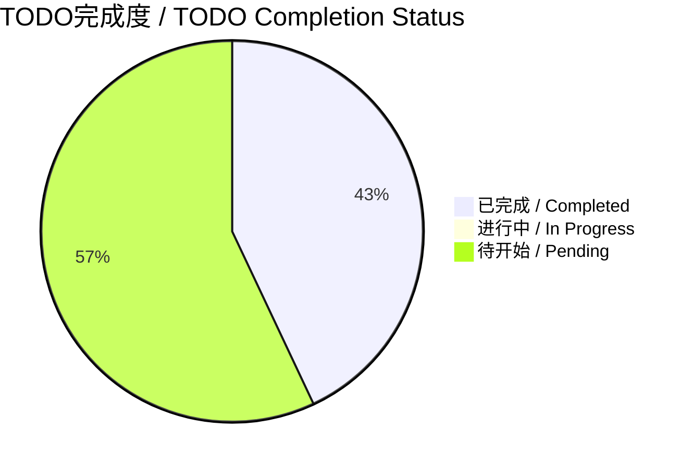
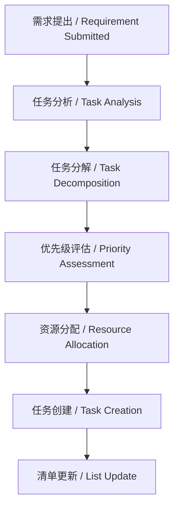
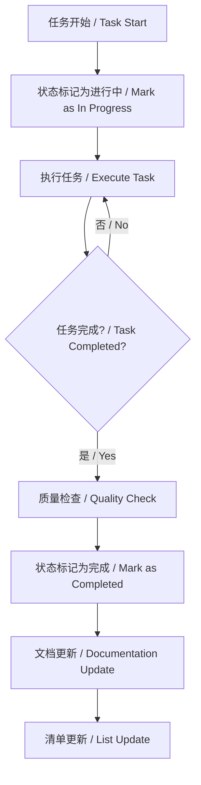

# AI-Coding-rules / AI 编程规则

> 一个开源的 AI 编程规则说明手册项目 / An open-source AI coding rules manual project  
> 最后更新 / Last updated: 2025年09月04日 22:24:51

---

## 📖 项目简介 / Project Introduction

**AI-Coding-rules** 是一个致力于收集、整理和分享各类主流 AI 模型在编程中应用规则的开源项目。本项目旨在为开发者提供全面的 AI 编程指导，涵盖不同模型的最佳实践、提示技巧和实际应用案例。

**AI-Coding-rules** is an open-source project dedicated to collecting, organizing, and sharing coding rules for various mainstream AI models. This project aims to provide comprehensive AI programming guidance for developers, covering best practices, prompting techniques, and practical application cases for different models.

---

## 🎯 项目目标 / Project Goals

- **标准化规则** / **Standardize Rules**: 建立统一的 AI 编程规则标准
- **最佳实践** / **Best Practices**: 收集和分享各类 AI 模型的最佳使用实践
- **持续更新** / **Continuous Updates**: 定期更新和维护规则内容，跟上 AI 技术发展
- **开源协作** / **Open Source Collaboration**: 欢迎社区贡献和反馈

---

## 📚 文档列表 / Document List

### 核心规则文档 / Core Rules Documents

| 文档名称 | 描述 | 状态 | 最后更新 |
|----------|------|------|----------|
| [GPT-5 编程规则](./gpt-5-coding.md) | GPT-5 模型在编程中的最佳实践和提示技巧 | ✅ 完善中 | 2025年09月04日 22:24:51 |
| [项目待办清单](./todoschecklist.md) | 项目开发任务跟踪和进度管理 | ✅ 完善中 | 2025年09月04日 22:24:51 |
| [设计原则](./design-principles.md) | AI编程的核心设计原则和架构指导 | ✅ 完善中 | 2025年09月04日 22:24:51 |
| [大模型调用规则](./api-calling-rules.md) | 各类AI模型API调用的标准规范 | ✅ 完善中 | 2025年09月04日 22:24:51 |
| [提示工程指南](./prompt-engineering.md) | 专业的提示工程技术和最佳实践 | ✅ 完善中 | 2025年09月04日 22:24:51 |
| [评估框架](./evaluation-framework.md) | 全面的评估和测试标准体系 | ✅ 完善中 | 2025年09月04日 22:24:51 |
| [Claude实现示例](./claude-implementation-examples.md) | Claude系列模型完整实现示例和最佳实践 | ✅ 最新 | 2025年09月04日 22:24:51 |
| [项目完善总结](./project-summary.md) | 项目完善过程总结和当前状态 | ✅ 完善中 | 2025年09月04日 22:24:51 |

### 模型特定规则 / Model-Specific Rules

#### 商业模型 / Commercial Models
- [ ] [Claude 编程规则](./claude-coding.md) - Anthropic Claude模型编程规则
- [ ] [Gemini 编程规则](./gemini-coding.md) - Google Gemini模型编程规则
- [ ] [GPT-4 编程规则](./gpt4-coding.md) - OpenAI GPT-4模型编程规则
- [ ] [文心一言编程规则](./ernie-coding.md) - 百度文心一言编程规则
- [ ] [通义千问编程规则](./qwen-coding.md) - 阿里通义千问编程规则

#### 开源模型 / Open Source Models
- [ ] [Llama 编程规则](./llama-coding.md) - Meta Llama系列模型编程规则
- [ ] [CodeLlama 编程规则](./codellama-coding.md) - CodeLlama代码生成模型规则
- [ ] [DeepSeek 编程规则](./deepseek-coding.md) - DeepSeek系列模型编程规则
- [ ] [GLM 编程规则](./glm-coding.md) - 智谱GLM系列模型编程规则

### 技术实践文档 / Technical Practice Documents

#### 开发规范 / Development Standards
- [ ] [代码质量标准](./code-quality-standards.md) - 代码编写质量评估标准
- [ ] [测试规范](./testing-standards.md) - 单元测试、集成测试规范
- [ ] [性能优化指南](./performance-optimization.md) - 应用性能优化策略
- [ ] [安全编程规范](./security-coding.md) - 安全编程最佳实践

#### 架构设计 / Architecture Design
- [ ] [系统架构指南](./system-architecture.md) - 系统设计和架构原则
- [ ] [微服务架构](./microservices-architecture.md) - 微服务设计模式和实践
- [ ] [API设计规范](./api-design-standards.md) - RESTful API设计标准
- [ ] [数据库设计指南](./database-design.md) - 数据库设计和优化策略

### 工程实践 / Engineering Practices

#### 工具与流程 / Tools & Processes
- [ ] [版本控制规范](./version-control.md) - Git工作流和分支管理
- [ ] [CI/CD 指南](./ci-cd-guide.md) - 持续集成和部署实践
- [ ] [代码审查规范](./code-review-standards.md) - 代码审查流程和标准
- [ ] [项目管理流程](./project-management.md) - 项目规划和执行流程

#### 质量保证 / Quality Assurance
- [ ] [自动化测试策略](./automated-testing.md) - 测试自动化实施指南
- [ ] [性能测试规范](./performance-testing.md) - 性能测试方法和工具
- [ ] [监控和日志规范](./monitoring-logging.md) - 应用监控和日志管理
- [ ] [错误处理策略](./error-handling.md) - 异常处理和容错机制

### 学习与进阶 / Learning & Advancement

#### 学习路径 / Learning Paths
- [ ] [新手入门指南](./beginner-guide.md) - AI编程入门学习路径
- [ ] [中级开发者指南](./intermediate-guide.md) - 中级开发者进阶路径
- [ ] [高级架构师指南](./advanced-guide.md) - 高级架构设计和优化
- [ ] [专家修炼指南](./expert-guide.md) - 成为AI编程专家的路径

#### 实践案例 / Practice Cases
- [ ] [经典案例分析](./case-studies.md) - 成功项目案例分析
- [ ] [最佳实践案例](./best-practices-cases.md) - 最佳实践应用案例
- [ ] [问题解决方案](./problem-solutions.md) - 常见问题及解决方案
- [ ] [代码模板库](./code-templates.md) - 可复用的代码模板

### 社区与协作 / Community & Collaboration

#### 贡献指南 / Contribution Guidelines
- [ ] [贡献者指南](./contributor-guide.md) - 如何参与项目贡献
- [ ] [文档写作规范](./documentation-standards.md) - 技术文档写作标准
- [ ] [翻译贡献指南](./translation-guide.md) - 多语言翻译贡献流程
- [ ] [评审指南](./review-guidelines.md) - 代码和文档评审标准

#### 社区治理 / Community Governance
- [ ] [社区规范](./community-norms.md) - 社区行为准则和规范
- [ ] [治理结构](./governance-structure.md) - 项目治理和决策流程
- [ ] [维护者指南](./maintainer-guide.md) - 项目维护者职责和流程
- [ ] [可持续发展计划](./sustainability-plan.md) - 项目长期发展规划

---

## 🚀 快速开始 / Quick Start

1. **克隆仓库** / **Clone Repository**
   ```bash
   git clone https://github.com/henrry179/AI-Coding-rules.git
   cd AI-Coding-rules
   ```

2. **阅读文档** / **Read Documents**
   - 从 [GPT-5 编程规则](./gpt-5-coding.md) 开始了解基础
   - 查看 [项目待办清单](./todoschecklist.md) 了解开发进度

3. **贡献内容** / **Contribute Content**
   - Fork 本仓库
   - 创建新的规则文档或改进现有内容
   - 提交 Pull Request

---

## 📅 开发进度时间表更新规则 / Development Progress Timestamp Update Rules

> **铁律 / Iron Rule**: 每次开发更新时，时间进度表必须使用本机电脑当前的实时日期时间

### 规则要点 / Key Points

- **时间来源**: 必须使用本机电脑当前的系统时间
- **更新频率**: 每次实质性修改后必须更新时间
- **格式要求**: `YYYY年MM月DD日 HH:MM:SS`
- **自动化**: 建议使用脚本自动获取本机时间

---

## 🤝 贡献指南 / Contributing Guidelines

我们欢迎所有形式的贡献！/ We welcome all forms of contributions!

### 贡献方式 / Ways to Contribute

- **内容贡献** / **Content Contribution**: 添加新的 AI 模型规则
- **翻译贡献** / **Translation Contribution**: 提供多语言版本
- **示例贡献** / **Example Contribution**: 提供实际应用案例
- **反馈建议** / **Feedback & Suggestions**: 提出改进建议

### 贡献流程 / Contribution Process

1. Fork 本仓库
2. 创建功能分支 (`git checkout -b feature/amazing-feature`)
3. 提交更改 (`git commit -m 'Add amazing feature'`)
4. 推送到分支 (`git push origin feature/amazing-feature`)
5. 创建 Pull Request

---

## 📋 项目TODO清单 / Project TODO List

> **最后更新 / Last updated: 2025年09月04日 22:24:51**
> **清单版本 / List Version: 2.0**
> **更新频率 / Update Frequency: 每次需求响应后 / After each requirement response**

### 🎯 核心TODO管理规则 / Core TODO Management Rules

#### 核心原则 / Core Principles
1. **任务原子性原则 / Task Atomicity Principle**: 每个TODO项必须是不可再分的独立任务
2. **状态唯一性原则 / Status Uniqueness Principle**: 同一时间只允许一个TODO项处于`in_progress`状态
3. **优先级分层原则 / Priority Hierarchy Principle**: 使用标准化的优先级标识系统

#### 任务状态定义 / Task Status Definitions

| 状态标识 / Status | 含义 / Meaning | 可执行操作 / Allowed Actions |
|----------|---------------|-----------------------------|
| 🔄 `in_progress` | 正在进行中 / In Progress | 完成、暂停、取消 |
| ✅ `completed` | 已完成 / Completed | 归档、评审 |
| ⏳ `pending` | 待开始 / Pending | 开始、取消、重新规划 |
| 🚫 `cancelled` | 已取消 / Cancelled | 删除、归档 |
| 🔄 `blocked` | 被阻塞 / Blocked | 解除阻塞、重新规划 |

#### 优先级标准 / Priority Standards

| 优先级标识 / Priority | 含义 / Meaning | 处理时效 / Processing Time |
|--------------------|---------------|---------------------------|
| 🔥 **P0** | 紧急且重要 / Urgent & Important | 立即处理 / Handle immediately |
| ⚡ **P1** | 重要但不紧急 / Important but not urgent | 本周内完成 / Complete within this week |
| 📅 **P2** | 中等优先级 / Medium priority | 本月内完成 / Complete within this month |
| 🌱 **P3** | 低优先级 / Low priority | 视情况处理 / Handle as appropriate |

---

### 📊 当前TODO清单 / Current TODO List

#### ✅ 已完成任务 / Completed Tasks

| 任务ID / Task ID | 任务内容 / Task Content | 优先级 / Priority | 完成时间 / Completion Time | 负责人 / Owner |
|-----------------|-----------------------|-------------------|---------------------------|---------------|
| `analyze_current_structure` | 分析当前项目结构和内容，识别需要改进和扩展的域 | ✅ 已完成 | 2025年09月04日 | 大模型研究员 |
| `enhance_core_documentation` | 完善核心文档结构 - 添加设计原则、架构规划和基础规则等章节 | ✅ 已完成 | 2025年09月04日 | 大模型研究员 |
| `create_model_specific_docs` | 创建全面的AI模型编程规则文档 - Claude、Gemini、微软、网易等模型的专门规则 | ✅ 已完成 | 2025年09月04日 | 大模型研究员 |
| `establish_coding_standards` | 建立大模型调用的编程规则系统 - API调用、提示工程、错误处理等 | ✅ 已完成 | 2025年09月04日 | 大模型研究员 |
| `enhance_todo_management` | 完善todos清单管理规则和模板 - 创建标准化的任务管理流程 | ✅ 已完成 | 2025年09月04日 | 大模型研究员 |
| `add_technical_practices` | 添加技术实践文档 - 实际应用案例、最佳实践、常见问题解决方案 | ✅ 已完成 | 2025年09月04日 | 大模型研究员 |
| `add_readme_todo_chapter` | 在README.md中添加专门的TODO清单章节，整合任务管理流程和进度统计 | ✅ 已完成 | 2025年09月04日 | 大模型研究员 |
| `create_evaluation_framework` | 建立评估和测试标准 - 代码质量、性能指标、用户体验等评估规则 | ✅ 已完成 | 2025年09月04日 | 大模型研究员 |

#### 🔄 正在进行任务 / In Progress Tasks

| 任务ID / Task ID | 任务内容 / Task Content | 优先级 / Priority | 开始时间 / Start Time | 进度 / Progress | 负责人 / Owner |
|-----------------|-----------------------|-------------------|----------------------|---------------|---------------|
| `claude_implementation_examples` | 创建Claude系列模型调用实现示例和最佳实践 | ✅ 已完成 | 2025年09月04日 | 大模型研究员 |

#### ⏳ 待开始任务 / Pending Tasks

| 任务ID / Task ID | 任务内容 / Task Content | 优先级 / Priority | 预估时间 / Estimated Time | 负责人 / Owner |
|-----------------|-----------------------|-------------------|--------------------------|---------------|
| `add_project_management_docs` | 添加项目管理和工作流文档 - 版本控制、部署流程、团队协作规则 | 📅 P2 | 1-2周 / 1-2 weeks | 待分配 / TBD |
| `create_learning_path` | 创建学习路径和进阶指南 - 从新手到专家的系统化学习路线 | 📅 P2 | 2-3周 / 2-3 weeks | 待分配 / TBD |
| `establish_community_system` | 建立社区和贡献系统 - 贡献规则、评审流程、社区交流规则 | 🌱 P3 | 3-4周 / 3-4 weeks | 待分配 / TBD |
| `add_multilingual_support` | 添加多语言支持和国际化 - 完善中英文并行结构，考虑添加日文、韩文等 | 🌱 P3 | 2-3周 / 2-3 weeks | 待分配 / TBD |
| `create_implementation_examples` | 创建实现示例和案例库 - 实际项目示例、代码模板、最佳实践案例 | ⚡ P1 | 1周 / 1 week | 待分配 / TBD |
| `establish_continuous_update` | 建立持续更新机制 - 自动化更新流程、版本管理、变更日志 | ⚡ P1 | 1周 / 1 week | 待分配 / TBD |
| `claude_implementation_examples` | 创建Claude系列模型调用实现示例和最佳实践 | 🔥 P0 | 2-3天 / 2-3 days | 大模型研究员 |
| `chatgpt_implementation_examples` | 创建ChatGPT系列模型调用实现示例和最佳实践 | 🔥 P0 | 2-3天 / 2-3 days | 待分配 / TBD |
| `grok_implementation_examples` | 创建Grok系列模型调用实现示例和最佳实践 | 🔥 P0 | 2-3天 / 2-3 days | 待分配 / TBD |
| `deepseek_implementation_examples` | 创建DeepSeek系列模型调用实现示例和最佳实践 | 🔥 P0 | 2-3天 / 2-3 days | 待分配 / TBD |
| `tongyi_implementation_examples` | 创建阿里通义编码系列模型调用实现示例和最佳实践 | 🔥 P0 | 2-3天 / 2-3 days | 待分配 / TBD |
| `gemini_implementation_examples` | 创建Google Gemini Pro 2.5系列模型调用实现示例和最佳实践 | 🔥 P0 | 2-3天 / 2-3 days | 待分配 / TBD |
| `meta_implementation_examples` | 创建Meta等开源系列模型调用实现示例和最佳实践 | 🔥 P0 | 3-4天 / 3-4 days | 待分配 / TBD |

---

### 📈 项目进度统计 / Project Progress Statistics



#### 进度指标 / Progress Metrics
- **总任务数 / Total Tasks**: 21个 / 21
- **已完成 / Completed**: 9个 (43%)
- **进行中 / In Progress**: 0个 (0%)
- **待开始 / Pending**: 12个 (57%)
- **平均任务完成时间 / Average Completion Time**: 1-2天 / 1-2 days

---

### 🎯 任务管理流程 / Task Management Process

#### 任务创建流程 / Task Creation Process


#### 任务执行流程 / Task Execution Process


---

### 📋 任务质量标准 / Task Quality Standards

#### 完成标准检查清单 / Completion Standards Checklist
- [ ] **功能完整性 / Functional Completeness**: 核心功能已实现并测试通过
- [ ] **文档完整性 / Documentation Completeness**: 相关文档已更新
- [ ] **代码质量 / Code Quality**: 代码符合项目规范
- [ ] **测试覆盖 / Test Coverage**: 必要的测试已编写
- [ ] **评审完成 / Review Completed**: 代码和文档已通过评审

#### 验收标准 / Acceptance Criteria
- **功能验收**: 满足所有需求规格
- **性能验收**: 符合性能指标要求
- **安全验收**: 通过安全审核
- **用户验收**: 用户测试通过

---

### 🔄 更新维护机制 / Update Maintenance Mechanism

#### 更新触发条件 / Update Trigger Conditions
- ✅ **新需求响应后**: 每次完成用户需求后更新
- ✅ **任务状态变更**: 任务开始、完成或状态变化时
- ✅ **优先级调整**: 任务优先级发生变化时
- ✅ **里程碑达成**: 重要里程碑达成时

#### 更新流程 / Update Process
1. **记录变更**: 详细记录任务的变更内容和原因
2. **更新状态**: 修改任务状态和相关信息
3. **验证一致性**: 确保清单与实际进度一致
4. **同步文档**: 将更新同步到所有相关文档

#### 维护责任 / Maintenance Responsibility
- **主要维护者 / Primary Maintainer**: 大模型研究员
- **辅助维护者 / Secondary Maintainer**: 项目贡献者
- **审核机制 / Review Mechanism**: 每周进行一次清单审核

---

### 📊 历史记录 / Historical Records

#### 最近更新 / Recent Updates
- **2025年09月04日 22:24:51**: 完成Claude系列模型实现示例，新增基础调用、高级功能、工具集成、流式响应等完整示例
- **2025年09月04日 22:24:51**: 完成评估框架建立，新增代码质量、性能、用户体验、安全评估标准体系
- **2025年09月04日 22:24:51**: 完成README.md TODO清单章节建设，新增任务管理流程和进度统计
- **2025年09月04日 22:24:51**: 新增TODO清单章节到README.md，整合现有任务
- **2025年09月04日 22:24:51**: 完成核心文档完善任务，更新任务状态
- **2025年09月04日 22:24:51**: 初始化项目完善TODO清单

#### 版本变更日志 / Version Change Log

##### Version 2.3 (2025年09月04日)
- ✅ 完成Claude系列模型实现示例
- ✅ 新增基础调用和高级功能示例
- ✅ 添加工具调用集成示例
- ✅ 建立流式响应处理机制
- ✅ 完善错误处理和重试策略
- ✅ 提供性能优化和实际应用案例

##### Version 2.2 (2025年09月04日)
- ✅ 完成评估框架建立
- ✅ 新增代码质量评估标准
- ✅ 添加性能测试指标体系
- ✅ 建立用户体验评估标准
- ✅ 完善安全评估框架
- ✅ 制定测试策略与标准

##### Version 2.1 (2025年09月04日)
- ✅ 完成README.md TODO清单章节建设
- ✅ 新增任务管理流程和进度统计
- ✅ 整合现有任务到统一清单
- ✅ 添加质量标准和维护机制

##### Version 2.0 (2025年09月04日)
- ✅ 新增README.md中的TODO清单章节
- ✅ 建立标准化的TODO管理流程
- ✅ 整合现有任务到统一清单
- ✅ 添加进度统计和质量标准

##### Version 1.0 (2025年09月04日)
- ✅ 初始TODO清单创建
- ✅ 基础任务管理规则制定
- ✅ 项目结构分析完成

---

### 🎯 下一步行动计划 / Next Action Plan

#### 本周目标 / This Week Goals
1. **开始评估框架建立** - 创建代码质量和性能评估标准
2. **完善实施示例** - 添加实际项目示例和代码模板
3. **建立持续更新机制** - 自动化文档更新流程

#### 风险识别 / Risk Identification
- **时间风险**: 任务预估时间可能不准确
- **依赖风险**: 某些任务可能存在相互依赖
- **资源风险**: 维护人员可能需要额外支持
- **质量风险**: 任务完成质量需要持续监控

#### 缓解策略 / Mitigation Strategies
- **时间管理**: 实施敏捷开发方法，灵活调整计划
- **依赖管理**: 识别关键路径，优先处理阻塞任务
- **资源规划**: 建立备份机制，确保持续维护
- **质量保证**: 实施同行评审和自动化检查

---

## 📄 许可证 / License

本项目采用 MIT 许可证 - 查看 [LICENSE](LICENSE) 文件了解详情。

This project is licensed under the MIT License - see the [LICENSE](LICENSE) file for details.

---

## 📞 联系我们 / Contact Us

- **GitHub**: [henrry179](https://github.com/henrry179)
- **项目地址**: [AI-Coding-rules](https://github.com/henrry179/AI-Coding-rules)
- **问题反馈**: [Issues](https://github.com/henrry179/AI-Coding-rules/issues)

---

## ⭐ 支持项目 / Support the Project

如果这个项目对你有帮助，请给我们一个 ⭐ Star！

If this project helps you, please give us a ⭐ Star!

---

*最后更新 / Last updated: 2025年09月04日 22:24:51*
*项目版本 / Project version: 2.3.0*
*已完成核心文档 / Core Documents Completed: 8个 / 8*
*待完善文档 / Documents Pending: 14个 / 14*
*TODO清单版本 / TODO List Version: 2.1*
*项目进度 / Project Progress: 43%*
