# AI编程设计原则 / AI Programming Design Principles

> 本文档阐述AI编程的核心设计原则和架构指导原则
> This document outlines the core design principles and architectural guidelines for AI programming

**最后更新 / Last updated: 2025年09月02日 11:09:34**

---

## 📋 目录 / Table of Contents

- [概述 / Overview](#概述--overview)
- [核心设计原则 / Core Design Principles](#核心设计原则--core-design-principles)
- [架构设计原则 / Architecture Design Principles](#架构设计原则--architecture-design-principles)
- [AI集成原则 / AI Integration Principles](#ai集成原则--ai-integration-principles)
- [用户体验原则 / User Experience Principles](#用户体验原则--user-experience-principles)
- [性能优化原则 / Performance Optimization Principles](#性能优化原则--performance-optimization-principles)
- [安全与隐私原则 / Security and Privacy Principles](#安全与隐私原则--security-and-privacy-principles)
- [可维护性原则 / Maintainability Principles](#可维护性原则--maintainability-principles)
- [实施指南 / Implementation Guidelines](#实施指南--implementation-guidelines)

---

## 概述 / Overview

### 设计理念 / Design Philosophy

AI编程设计原则旨在指导开发者构建高质量、可维护、可扩展的AI应用程序。这些原则基于软件工程最佳实践，结合AI技术的特殊性，为AI应用开发提供系统化的指导框架。

The AI programming design principles aim to guide developers in building high-quality, maintainable, and scalable AI applications. These principles are based on software engineering best practices, combined with the unique characteristics of AI technology, providing a systematic guidance framework for AI application development.

### 适用范围 / Scope of Application

- ✅ **适用**: AI模型集成、提示工程、AI服务架构、用户交互设计
- ✅ **适用**: 机器学习应用、自动化系统、智能化产品
- ❌ **不适用**: 传统软件开发原则（已由现有标准覆盖）

---

## 核心设计原则 / Core Design Principles

### 🎯 1. 用户中心设计 / User-Centric Design

#### 原则阐述 / Principle Statement
以用户需求为核心，AI功能应服务于用户目标，而非技术本身。

AI functionality should serve user goals rather than technology itself, with user needs at the core.

#### 实施要点 / Implementation Points

**用户需求优先 / User Needs First**
```xml
<user_centric_design>
  <!-- 用户需求分析优先于技术实现 / User needs analysis takes precedence over technical implementation -->
  <requirement_analysis>
    - 识别核心用户痛点 / Identify core user pain points
    - 量化用户收益 / Quantify user benefits
    - 验证假设有效性 / Validate hypothesis effectiveness
  </requirement_analysis>

  <value_proposition>
    - 明确AI带来的独特价值 / Clarify unique value brought by AI
    - 设定可衡量的成功指标 / Set measurable success metrics
    - 建立用户反馈机制 / Establish user feedback mechanisms
  </value_proposition>
</user_centric_design>
```

**渐进式功能暴露 / Progressive Feature Exposure**
- 从简单功能开始，逐步引入复杂AI特性
- 提供功能开关，让用户控制AI介入程度
- 确保AI增强而非替代用户能力

### 🔧 2. 可靠性优先 / Reliability First

#### 原则阐述 / Principle Statement
AI系统的可靠性比功能丰富性更重要，可靠性包括技术可靠性和用户信任度。

The reliability of AI systems is more important than feature richness, and reliability includes both technical reliability and user trust.

#### 实施要点 / Implementation Points

**故障恢复机制 / Failure Recovery Mechanisms**
```xml
<reliability_framework>
  <graceful_degradation>
    <!-- 优雅降级策略 / Graceful degradation strategy -->
    - AI服务不可用时提供备选方案 / Provide alternative solutions when AI service is unavailable
    - 缓存机制确保基本功能可用 / Caching ensures basic functionality is available
    - 用户友好的错误提示 / User-friendly error messages
  </graceful_degradation>

  <monitoring_and_alerting>
    <!-- 监控和告警系统 / Monitoring and alerting system -->
    - 实时性能监控 / Real-time performance monitoring
    - 异常检测和自动恢复 / Anomaly detection and automatic recovery
    - 用户影响评估 / User impact assessment
  </monitoring_and_alerting>
</reliability_framework>
```

**透明度要求 / Transparency Requirements**
- 明确告知用户AI的局限性和可能错误
- 提供AI决策的解释和依据
- 建立用户反馈和纠正机制

### 📈 3. 可扩展性设计 / Scalability Design

#### 原则阐述 / Principle Statement
系统应能平滑应对用户增长、数据增加和功能扩展的需求。

The system should smoothly handle the needs of user growth, data increase, and feature expansion.

#### 实施要点 / Implementation Points

**模块化架构 / Modular Architecture**
```xml
<scalability_patterns>
  <service_decomposition>
    <!-- 服务拆分策略 / Service decomposition strategy -->
    - 按业务领域划分微服务 / Divide microservices by business domain
    - API网关统一入口 / API gateway unified entrance
    - 独立部署和扩展 / Independent deployment and scaling
  </service_decomposition>

  <data_layer_scaling>
    <!-- 数据层扩展 / Data layer scaling -->
    - 读写分离设计 / Read-write separation design
    - 缓存策略优化 / Cache strategy optimization
    - 数据分片机制 / Data sharding mechanism
  </data_layer_scaling>
</scalability_patterns>
```

**资源管理策略 / Resource Management Strategy**
- 动态资源分配和释放
- 负载均衡和流量控制
- 成本效益优化

---

## 架构设计原则 / Architecture Design Principles

### 🏗️ 4. 分层架构 / Layered Architecture

#### 原则阐述 / Principle Statement
采用清晰的分层架构，将AI逻辑、业务逻辑和用户界面分离。

Adopt a clear layered architecture to separate AI logic, business logic, and user interface.

#### 架构层次 / Architecture Layers

```mermaid
graph TB
    A[表示层 / Presentation Layer] --> B[应用层 / Application Layer]
    B --> C[领域层 / Domain Layer]
    C --> D[基础设施层 / Infrastructure Layer]

    A --> E[AI服务层 / AI Service Layer]
    B --> E
    C --> E
    D --> E
```



**各层职责 / Layer Responsibilities**

| 层次 / Layer | 职责 / Responsibility | AI集成点 / AI Integration Points |
|-------------|----------------------|-------------------------------|
| 表示层 / Presentation | 用户界面、交互设计 | 结果展示、用户反馈收集 |
| 应用层 / Application | 业务流程编排、用例实现 | 流程自动化、决策支持 |
| 领域层 / Domain | 业务规则、领域模型 | 专家系统、预测分析 |
| 基础设施层 / Infrastructure | 数据存储、外部服务 | 模型部署、数据管道 |

### 🔄 5. 事件驱动架构 / Event-Driven Architecture

#### 原则阐述 / Principle Statement
采用事件驱动模式处理AI异步操作和实时响应需求。

Use event-driven patterns to handle AI asynchronous operations and real-time response requirements.

#### 事件流设计 / Event Flow Design

```xml
<event_driven_ai>
  <event_types>
    <!-- 事件类型定义 / Event type definitions -->
    <user_events>用户交互事件 / User interaction events</user_events>
    <ai_events>AI处理事件 / AI processing events</ai_events>
    <system_events>系统状态事件 / System status events</system_events>
  </event_types>

  <processing_patterns>
    <!-- 处理模式 / Processing patterns -->
    <async_processing>异步处理模式 / Asynchronous processing pattern</async_processing>
    <stream_processing>流处理模式 / Stream processing pattern</async_processing>
    <batch_processing>批处理模式 / Batch processing pattern</batch_processing>
  </processing_patterns>
</event_driven_ai>
```

---

## AI集成原则 / AI Integration Principles

### 🤖 6. AI服务抽象 / AI Service Abstraction

#### 原则阐述 / Principle Statement
通过抽象层隔离具体AI模型实现，便于模型切换和维护。

Isolate specific AI model implementations through abstraction layers to facilitate model switching and maintenance.

#### 抽象设计 / Abstraction Design

```xml
<ai_service_abstraction>
  <interface_layer>
    <!-- 接口层定义 / Interface layer definition -->
    <standard_api>标准化API接口 / Standardized API interface</standard_api>
    <configuration>配置管理 / Configuration management</configuration>
    <monitoring>监控集成 / Monitoring integration</monitoring>
  </interface_layer>

  <implementation_layer>
    <!-- 实现层 / Implementation layer -->
    <model_adapters>模型适配器 / Model adapters</model_adapters>
    <fallback_mechanisms>降级机制 / Fallback mechanisms</fallback_mechanisms>
    <performance_optimization>性能优化 / Performance optimization</performance_optimization>
  </implementation_layer>
</ai_service_abstraction>
```

### 🎯 7. 提示工程标准化 / Prompt Engineering Standardization

#### 原则阐述 / Principle Statement
建立标准化的提示工程流程，确保AI输出的稳定性和质量。

Establish standardized prompt engineering processes to ensure stability and quality of AI outputs.

#### 提示管理策略 / Prompt Management Strategy

```xml
<prompt_engineering_standard>
  <prompt_templates>
    <!-- 提示模板 / Prompt templates -->
    <task_specific>任务特定模板 / Task-specific templates</task_specific>
    <context_aware>上下文感知模板 / Context-aware templates</context_aware>
    <adaptive>自适应模板 / Adaptive templates</adaptive>
  </prompt_templates>

  <quality_assurance>
    <!-- 质量保证 / Quality assurance -->
    <validation_rules>验证规则 / Validation rules</validation_rules>
    <testing_framework>测试框架 / Testing framework</testing_framework>
    <performance_metrics>性能指标 / Performance metrics</performance_metrics>
  </quality_assurance>
</prompt_engineering_standard>
```

---

## 用户体验原则 / User Experience Principles

### 👥 8. 渐进式AI采用 / Progressive AI Adoption

#### 原则阐述 / Principle Statement
让用户逐步适应AI功能，从简单辅助到深度集成。

Allow users to gradually adapt to AI functionality, from simple assistance to deep integration.

#### 采用策略 / Adoption Strategy

**阶段性功能引入 / Phased Feature Introduction**
```xml
<progressive_adoption>
  <phase_1>基础辅助 / Basic Assistance</phase_1>
  - 拼写检查和语法建议 / Spelling and grammar suggestions
  - 简单自动化任务 / Simple automation tasks
  - 可选的AI增强功能 / Optional AI enhancement features

  <phase_2>智能协作 / Intelligent Collaboration</phase_2>
  - 上下文感知建议 / Context-aware suggestions
  - 主动式帮助 / Proactive assistance
  - 个性化定制 / Personalized customization

  <phase_3>深度集成 / Deep Integration</phase_3>
  - 自主决策支持 / Autonomous decision support
  - 复杂任务自动化 / Complex task automation
  - 学习和适应机制 / Learning and adaptation mechanisms
</progressive_adoption>
```

### 🔍 9. 透明度和可控性 / Transparency and Controllability

#### 原则阐述 / Principle Statement
用户应清楚了解AI的工作原理，并能控制AI的行为。

Users should clearly understand how AI works and be able to control AI behavior.

#### 透明度实现 / Transparency Implementation

**AI决策解释 / AI Decision Explanation**
- 提供AI推理过程的可视化
- 解释决策依据和置信度
- 允许用户查看和修改AI参数

**控制机制 / Control Mechanisms**
- AI功能开关和权限设置
- 用户反馈和纠正功能
- 自定义AI行为偏好

---

## 性能优化原则 / Performance Optimization Principles

### ⚡ 10. 智能缓存策略 / Intelligent Caching Strategy

#### 原则阐述 / Principle Statement
针对AI查询的特点设计缓存策略，提高响应速度和降低成本。

Design caching strategies based on AI query characteristics to improve response speed and reduce costs.

#### 缓存设计 / Cache Design

```xml
<ai_caching_strategy>
  <cache_layers>
    <!-- 缓存层次 / Cache layers -->
    <memory_cache>内存缓存 / Memory cache</memory_cache>
    <distributed_cache>分布式缓存 / Distributed cache</distributed_cache>
    <persistent_cache>持久化缓存 / Persistent cache</persistent_cache>
  </cache_layers>

  <cache_invalidation>
    <!-- 缓存失效策略 / Cache invalidation strategy -->
    <time_based>时间基础失效 / Time-based invalidation</time_based>
    <content_based>内容基础失效 / Content-based invalidation</content_based>
    <event_driven>事件驱动失效 / Event-driven invalidation</event_driven>
  </cache_invalidation>
</ai_caching_strategy>
```

### 📊 11. 资源使用优化 / Resource Usage Optimization

#### 原则阐述 / Principle Statement
合理分配计算资源，确保AI功能的高效运行。

Reasonably allocate computing resources to ensure efficient operation of AI functionality.

#### 资源管理 / Resource Management

**动态资源分配 / Dynamic Resource Allocation**
- 根据负载调整资源使用
- 实现自动扩缩容
- 优化成本效益比

**能效优化 / Energy Efficiency**
- 选择合适的AI模型大小
- 实现计算资源复用
- 采用节能算法

---

## 安全与隐私原则 / Security and Privacy Principles

### 🔒 12. 数据保护优先 / Data Protection First

#### 原则阐述 / Principle Statement
在AI应用中，数据安全和隐私保护是核心要求。

In AI applications, data security and privacy protection are core requirements.

#### 安全措施 / Security Measures

```xml
<data_protection>
  <data_minimization>
    <!-- 数据最小化 / Data minimization -->
    - 只收集必要数据 / Collect only necessary data
    - 数据脱敏处理 / Data desensitization
    - 定期数据清理 / Regular data cleanup
  </data_minimization>

  <access_control>
    <!-- 访问控制 / Access control -->
    - 角色基础访问 / Role-based access
    - 数据加密传输 / Encrypted data transmission
    - 审计日志记录 / Audit log recording
  </access_control>
</data_protection>
```

### 🛡️ 13. AI安全防护 / AI Security Protection

#### 原则阐述 / Principle Statement
防止AI系统被恶意利用，确保AI输出的安全性和可靠性。

Prevent AI systems from being maliciously exploited and ensure the security and reliability of AI outputs.

#### 防护策略 / Protection Strategy

**输入验证和过滤 / Input Validation and Filtering**
- 恶意输入检测
- 内容安全过滤
- 速率限制和防滥用

**输出安全检查 / Output Security Check**
- 敏感信息过滤
- 事实核查机制
- 偏见和有害内容检测

---

## 可维护性原则 / Maintainability Principles

### 🔧 14. 代码质量保证 / Code Quality Assurance

#### 原则阐述 / Principle Statement
编写清晰、可维护的代码，确保长期系统的可维护性。

Write clear, maintainable code to ensure long-term system maintainability.

#### 质量标准 / Quality Standards

```xml
<code_quality_standards>
  <coding_standards>
    <!-- 编码标准 / Coding standards -->
    <naming_conventions>命名规范 / Naming conventions</naming_conventions>
    <documentation>文档化要求 / Documentation requirements</documentation>
    <modular_design>模块化设计 / Modular design</modular_design>
  </coding_standards>

  <testing_standards>
    <!-- 测试标准 / Testing standards -->
    <unit_tests>单元测试 / Unit tests</unit_tests>
    <integration_tests>集成测试 / Integration tests</integration_tests>
    <ai_specific_tests>AI特定测试 / AI-specific tests</ai_specific_tests>
  </testing_standards>
</code_quality_standards>
```

### 📚 15. 文档化要求 / Documentation Requirements

#### 原则阐述 / Principle Statement
完善的文档是可维护性的基础，包括技术文档和用户文档。

Complete documentation is the foundation of maintainability, including both technical and user documentation.

#### 文档体系 / Documentation System

**技术文档 / Technical Documentation**
- API文档和接口说明
- 系统架构文档
- 部署和运维手册

**用户文档 / User Documentation**
- 用户指南和教程
- FAQ和故障排除
- 最佳实践指南

---

## 实施指南 / Implementation Guidelines

### 📋 16. 设计审查清单 / Design Review Checklist

#### 架构设计审查 / Architecture Design Review

- [ ] 是否遵循了分层架构原则？
- [ ] AI服务抽象是否充分？
- [ ] 扩展性设计是否考虑未来增长？
- [ ] 故障恢复机制是否完备？

#### 用户体验审查 / User Experience Review

- [ ] 用户需求是否充分理解？
- [ ] AI功能是否渐进式引入？
- [ ] 透明度和可控性是否实现？
- [ ] 性能表现是否满足用户期望？

#### 安全审查 / Security Review

- [ ] 数据保护措施是否到位？
- [ ] AI安全防护是否充分？
- [ ] 隐私政策是否明确？
- [ ] 合规要求是否满足？

### 🎯 17. 优先级排序 / Priority Ranking

#### 高优先级原则 / High Priority Principles
1. **可靠性优先** - 系统的稳定运行是基础
2. **用户中心设计** - 用户需求是核心驱动力
3. **数据保护优先** - 安全和隐私是底线要求

#### 中优先级原则 / Medium Priority Principles
4. **可扩展性设计** - 为未来发展预留空间
5. **性能优化原则** - 提升用户体验和效率
6. **透明度和可控性** - 建立用户信任

#### 持续关注原则 / Continuous Attention Principles
7. **代码质量保证** - 确保长期可维护性
8. **文档化要求** - 支持团队协作和知识传承
9. **智能缓存策略** - 优化资源使用

---

## 📅 开发进度时间表更新规则 / Development Progress Timestamp Update Rules

> **铁律 / Iron Rule**: 每次开发更新时，时间进度表必须使用本机电脑当前的实时日期时间

**最后更新 / Last updated: 2025年09月02日 11:09:34**
**文档版本 / Document version: 1.0.0**
