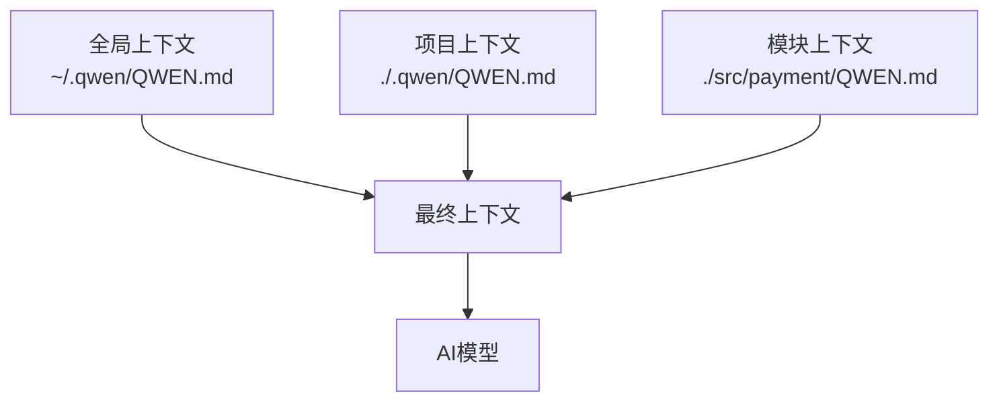

# Qwen Code CLI 完整指南

本文档是 Qwen Code CLI 的完整使用指南，涵盖了其四大核心功能：

1. [基于命令的AI工作流](#1-基于命令的ai工作流)
2. [分层内存与上下文系统](#2-分层内存与上下文系统)
3. [外部集成 (MCP)](#3-外部集成-mcp)
4. [内置工具集与操作方式](#4-内置工具集与操作方式)

## 目录

- [Qwen Code CLI 完整指南](#qwen-code-cli-完整指南)
  - [目录](#目录)
  - [简介](#简介)
  - [安装](#安装)
    - [系统要求](#系统要求)
    - [Windows安装](#windows安装)
    - [macOS安装](#macos安装)
    - [Linux安装](#linux安装)
  - [配置](#配置)
  - [1. 基于命令的AI工作流](#1-基于命令的ai工作流)
    - [工作机制](#工作机制)
    - [创建自定义命令](#创建自定义命令)
    - [示例：自动生成 Git Commit Message](#示例自动生成-git-commit-message)
  - [2. 分层内存与上下文系统](#2-分层内存与上下文系统)
    - [配置层级与优先级](#配置层级与优先级)
    - [管理命令](#管理命令)
  - [3. 外部集成：MCP (Model Context Protocol)](#3-外部集成-mcp-model-context-protocol)
    - [GitHub MCP 服务器配置](#github-mcp-服务器配置)
    - [安全设置](#安全设置)
    - [使用 MCP](#使用-mcp)
  - [4. 内置工具集与操作方式](#4-内置工具集与操作方式)
    - [工具概览与使用指南](#工具概览与使用指南)
    - [详细操作流程](#详细操作流程)
    - [沙箱安全机制](#沙箱安全机制)
    - [自定义沙箱环境](#自定义沙箱环境)
  - [基本使用](#基本使用)
  - [代码生成](#代码生成)
  - [高级功能](#高级功能)
  - [专业架构师视角](#专业架构师视角)
    - [核心架构概念](#核心架构概念)
    - [企业级部署建议](#企业级部署建议)
  - [入门者通俗解释](#入门者通俗解释)
    - [把 AI 当作实习生](#把-ai-当作实习生)
    - [简单工作流程](#简单工作流程)
  - [最佳实践](#最佳实践)
  - [故障排除](#故障排除)
    - [常见问题](#常见问题)
    - [获取帮助](#获取帮助)
  - [TODOS任务清单](#todos任务清单)

## 简介

Qwen Code CLI 是一款强大的命令行工具，它允许开发者通过自然语言与代码库进行交互，自动化各种开发任务。通过其四大核心功能，用户可以实现从简单的代码辅助到复杂的项目任务的自动化处理。

## 安装

### 系统要求

- Python 3.8 或更高版本
- Docker (用于MCP集成和沙箱功能)
- Git (用于版本控制集成)

### Windows安装

```cmd
pip install qwen-code-cli
```

> **注意**: Windows用户可能需要启用长路径支持。在PowerShell中以管理员身份运行：
> ```cmd
> reg add HKLM\SYSTEM\CurrentControlSet\Control\FileSystem /v LongPathsEnabled /t REG_DWORD /d 1
> ```

### macOS安装

```bash
pip3 install qwen-code-cli
```

> **推荐**: 使用WSL2获得更好的性能和兼容性

### Linux安装

```bash
pip3 install qwen-code-cli
```

> **注意**: Linux用户需要注意文件权限管理

## 配置

Qwen Code CLI的配置分为三个层级：

1. 全局配置 (`~/.qwen/`)
2. 项目配置 (`./.qwen/`)
3. 模块配置 (`./src/component/`)

## 1. 基于命令的AI工作流

Qwen Code 允许您通过创建简单的配置文件来定义可重用的 AI 命令，将复杂的任务自动化。

### 示例：自动生成 Git Commit Message

**文件位置：** `~/.qwen/commands/git/commit.toml`

**调用方式：** `/git:commit`

```toml
description = "根据暂存的更改生成 Git commit message。"

# prompt 中使用 !{...} 来执行命令并注入其输出。
prompt = """
请根据以下 git diff 生成一条 Conventional Commit 格式的 commit message：

!{git diff --staged}

"""
```

### 工作机制

1. 输入 `/git:commit`
2. CLI 执行 `!{git diff --staged}` 获取当前更改
3. 将差异注入到 Prompt 中并发送给 AI
4. AI 返回符合规范的 Commit Message

### 创建自定义命令

1. **创建命令文件：**
   ```bash
   mkdir -p ~/.qwen/commands/refactor
   touch ~/.qwen/commands/refactor/pure.toml
   ```

2. **添加内容：**
   ```toml
   # 调用方式：/refactor:pure
   description = "要求模型将当前上下文中的代码重构为纯函数。"
   prompt = """
   请分析我在当前上下文中的代码。
   将其重构为一个纯函数。
   
   你的回复应包括：
   1. 重构后的纯函数代码块。
   2. 简要说明你所做的关键更改。
   """
   ```

3. **使用命令：**
   ```bash
   > @my-messy-function.js
   > /refactor:pure
   ```

## 2. 分层内存与上下文系统

通过分层配置系统为 AI 提供精准的上下文指导。

### 配置层级与优先级



1. **全局上下文** (`~/.qwen/`): 所有项目的默认规则
2. **项目上下文** (`./.qwen/`): 当前项目的特定规范
3. **模块上下文** (`./src/component/`): 特定组件/模块的详细指令

**更具体的配置会覆盖更通用的配置。**

### 管理命令

- `/memory show` - 显示当前加载的完整上下文
- `/memory refresh` - 重新扫描并重新加载所有上下文文件

## 3. 外部集成：MCP (Model Context Protocol)

MCP 允许 AI 安全地与外部工具和服务交互。

### GitHub MCP 服务器配置

**配置文件位置：** `./.qwen/settings.json`

```json
{
  "mcpServers": {
    "github": {
      "command": "docker",
      "args": [
        "run",
        "-i",
        "--rm",
        "-e",
        "GITHUB_PERSONAL_ACCESS_TOKEN",
        "ghcr.io/github/github-mcp-server"
      ],
      "env": {
        "GITHUB_PERSONAL_ACCESS_TOKEN": "${GITHUB_PERSONAL_ACCESS_TOKEN}"
      }
    }
  }
}
```

### 安全设置

```bash
# 使用环境变量存储凭证，切勿硬编码
export GITHUB_PERSONAL_ACCESS_TOKEN="pat_YourActualTokenHere"
```

> **安全警告：** 始终使用细粒度的访问令牌，不要同时授予对公共和私有仓库的访问权限。

### 使用 MCP

```bash
# 配置后，可直接向AI提出相关请求
> 查看我们GitHub仓库中开放的issue
> 为feat/new-header分支创建一个PR
```

## 4. 内置工具集与操作方式

Qwen Code 提供了一套丰富的工具来与环境交互。

### 工具概览与使用指南

| 工具类别 | CLI 命令 | 描述 | 使用示例 |
| :--- | :--- | :--- | :--- |
| **文件操作** | `@` | 读取文件/目录内容 | `@src/app.py` `@docs/` |
| **Shell 执行** | `!` | 执行 shell 命令 | `!ls -la` `!npm install` |
| **网络获取** | (隐含) | 从 URL 获取内容 | `获取https://example.com/data.json` |
| **网络搜索** | (隐含) | 执行网络搜索 | `搜索Python最新特性` |
| **MCP 调用** | (隐含) | 与外部服务交互 | `查看GitHub PR状态` |

### 详细操作流程

#### 文件操作 (`@` 命令)

```bash
# 注入文件内容作为上下文
> @server/api.py
> 请为这个API端点添加身份验证
```

#### Shell 执行 (`!` 命令)

```bash
# 执行单条命令
> !git log --oneline -5

# 进入完整Shell模式
> !
[Shell] $ cd src/
[Shell] $ ls
[Shell] $ !  # 退出Shell模式
>
```

#### 网络工具

```bash
# 网络获取
> 请分析 https://api.github.com/repos/microsoft/vscode 返回的JSON数据

# 网络搜索
> 什么是Rust语言的所有权模型？请搜索最新教程
```

### 沙箱安全机制

在隔离环境中执行潜在危险操作：

```bash
# 在沙箱中启动CLI（推荐）
qwen code --sandbox

# 或使用简写
qwen code -s

# 或设置环境变量
export QWEN_SANDBOX=true
qwen code
```

**沙箱内所有操作都不会影响主机环境。**

### 自定义沙箱环境

创建 `.qwen/sandbox.Dockerfile` 来定义项目特定的沙箱环境：

```dockerfile
FROM qwen-code-sandbox

# 安装项目特定依赖
RUN apt-get update && apt-get install -y \
    python3-pip \
    && rm -rf /var/lib/apt/lists/*

# 安装Python包
RUN pip3 install requests pandas

# 设置环境变量
ENV PYTHONPATH=/app
```

## 基本使用

Qwen Code CLI的基本使用流程包括：

1. 初始化项目配置
2. 定义上下文文件
3. 使用命令与AI交互
4. 检查和优化结果

## 代码生成

使用Qwen Code CLI可以自动生成各种类型的代码，包括但不限于：

- API端点实现
- 数据库模型
- 单元测试
- 文档注释

## 高级功能

Qwen Code CLI的高级功能包括：

- 多模态支持
- 项目级操作
- 多语言/多模型支持
- 自定义命令系统

## 专业架构师视角

### 核心架构概念

1. **配置驱动架构**: 通过声明式配置定义 AI 行为，而非硬编码逻辑
2. **分层覆盖系统**: 实现"约定优于配置"的同时允许特定覆盖
3. **安全优先设计**: 沙箱机制和环境变量管理确保系统安全
4. **标准化扩展**: MCP 协议提供标准化集成方式
5. **工具生态系统**: 内置工具与外部服务形成完整能力矩阵

### 企业级部署建议

1. **创建公司级全局上下文**，定义统一代码规范和安全标准
2. **使用私有容器镜像仓库**存储自定义的沙箱镜像和 MCP 服务器
3. **建立凭证管理流程**，规范环境变量的使用和管理
4. **版本控制配置 files**，便于团队共享和审计
5. **制定沙箱使用政策**，明确什么操作需要在沙箱内执行

## 入门者通俗解释

### 把 AI 当作实习生

- **命令系统**: 教实习生如何完成特定任务
- **分层内存**: 给实习生发放不同层级的工作手册
- **MCP 集成**: 为实习生聘请专业翻译官
- **沙箱机制**: 给实习生安全的沙坑练习

### 简单工作流程

1. **教规矩**: 创建 `QWEN.md` 文件定义项目规范
2. **给工具**: 配置必要的 MCP 服务器和沙箱环境
3. **派任务**: 使用 `@` 和 `!` 命令指导 AI 工作
4. **保安全**: 在沙箱中执行不熟悉的操作

## 最佳实践

1. **安全性**: 始终使用最小权限原则，敏感信息通过环境变量管理
2. **版本控制**: 将 `.qwen/` 目录纳入版本控制（注意排除敏感信息）
3. **模块化**: 使用 `@import` 语法将大的上下文文件拆分为模块
4. **性能**: 对于大型项目，合理设置 `memoryDiscoveryMaxDirs` 值
5. **协作**: 在团队中共享有用的命令配置和上下文文件

## 故障排除

### 常见问题

1. **MCP 服务器连接失败**
   - 检查 Docker 是否运行
   - 验证环境变量是否正确设置
   - 确认镜像地址是否正确

2. **上下文文件未加载**
   - 使用 `/memory show` 检查加载状态
   - 运行 `/memory refresh` 强制刷新

3. **权限错误**
   - 在沙箱中执行潜在危险操作
   - 检查文件路径和权限

### 获取帮助

- 使用 `--help` 参数查看命令行帮助
- 查阅官方文档获取最新信息
- 检查日志文件获取详细错误信息

## TODOS任务清单

按照以下清单逐步完成Qwen Code CLI的学习和使用：

### 安装任务
- [ ] 检查系统要求
- [ ] 安装Qwen Code CLI
- [ ] 验证安装结果

### 配置任务
- [ ] 创建全局配置文件
- [ ] 设置项目配置
- [ ] 配置MCP集成（如需要）

### 基本使用任务
- [ ] 学习文件操作命令
- [ ] 学习Shell执行命令
- [ ] 练习基本交互流程

### 代码生成任务
- [ ] 生成简单代码示例
- [ ] 生成带注释的代码
- [ ] 自动生成测试代码

### 高级功能任务
- [ ] 创建自定义命令
- [ ] 配置分层内存系统
- [ ] 集成外部工具（MCP）
- [ ] 使用沙箱功能

---

通过本指南，您应该能够充分利用 Qwen Code CLI 的各项功能，从简单的代码辅助到复杂的项目任务，都能得心应手。